# ggplot2


```r
library(tidyverse)
```


```r
theme_set(theme_bw())                      # Standard Thema (Hintergrund, etc.) für die Grafiken 
df <- read_csv("data/gebrauchtwagen.csv")  # Daten einlesen
sample <- df %>% slice(1:500)              # Kleiner Datensatz, der die ersten 500 Zeilen umfasst
head(sample)
```

```
## # A tibble: 6 x 13
##   name        preis alter kilometer hersteller modell fahrzeugtyp getriebe    ps
##   <chr>       <dbl> <dbl>     <dbl> <chr>      <chr>  <chr>       <chr>    <dbl>
## 1 smart_forT~  5299     7     30000 smart      fortwo kleinwagen  automat~    71
## 2 Renault_Cl~  1100    16    125000 renault    clio   kleinwagen  manuell     75
## 3 Audi_A4_Av~  8199    14    150000 audi       a4     kombi       automat~   131
## 4 Mercedes_B~  8999     8    150000 mercedes_~ c_kla~ limousine   automat~   136
## 5 BMW_316_i_~  3600    13    150000 bmw        3er    limousine   manuell    116
## 6 verk._eine~  2490    11    150000 peugeot    1_rei~ kleinwagen  manuell     68
## # ... with 4 more variables: kraftstoff <chr>, schaden <chr>, plz <dbl>,
## #   bundesland <chr>
```

## Grundlagen

Minimale Angaben zur Erstellung einer Grafik:

- **Datensatz** (data)
- **Ästhetik-Zuordnung** (aesthetic mapping): Welche Variable des Datensatzes wird durch welche Ästhetik (x-Achse, y-Achse, Farbe, Größe, Form, ...) repräsentiert?
- **Geometrisches Objekt** (geometric object): z.B. Punkte, Linien, Balken, etc.


```r
ggplot(data = sample, mapping = aes(x = alter, y = preis)) + geom_point()
```

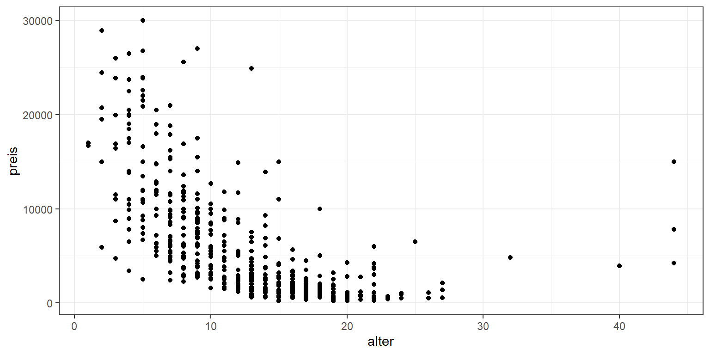

Wie ändert sich die Grafik, wenn wir den vollen Datensatz (df) verwenden?


```r
ggplot(data = df, mapping = aes(x = alter, y = preis)) + geom_point()
```

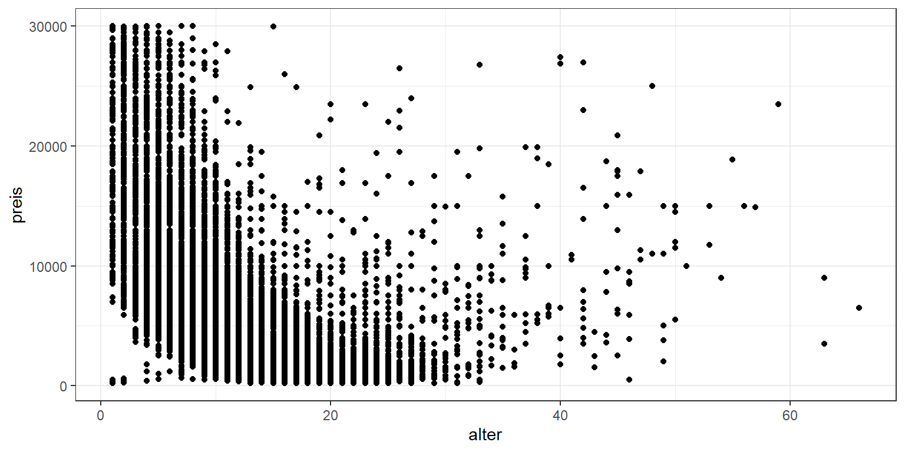


Wie ändert sich die Grafik, wenn wir eine andere Variablenzuordnung vornehmen?


```r
ggplot(data = sample, mapping = aes(x = preis, y = alter)) + geom_point()
```


```r
ggplot(data = sample, mapping = aes(x = preis, y = hersteller)) + geom_point()
```

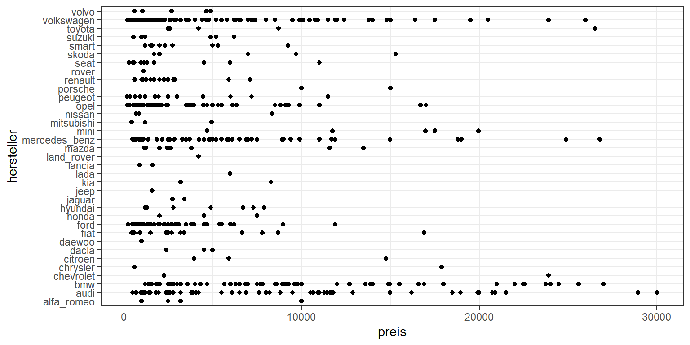

```r
ggplot(data = sample, mapping = aes(x = fahrzeugtyp, y = hersteller)) + geom_point()
```

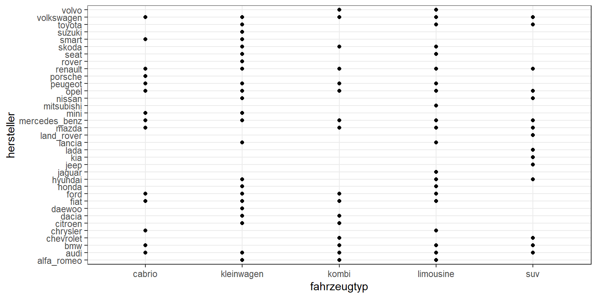


Wie ändert sich die Grafik, wenn wir einen anderen Objekttyp wählen?

```r
ggplot(data = sample, mapping = aes(x = fahrzeugtyp, y = hersteller)) + geom_jitter(width = 0.1)
```

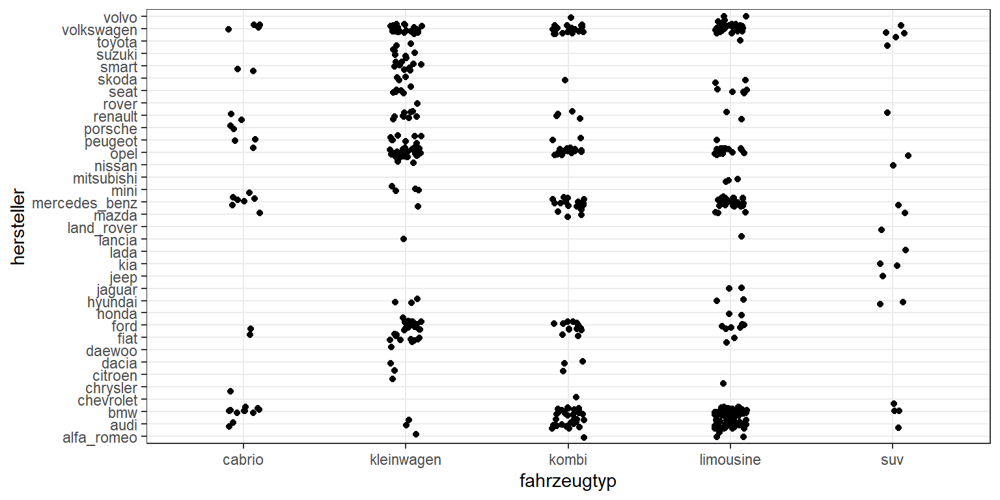

```r
ggplot(data = df, mapping = aes(x = alter, y = preis)) + geom_density2d_filled()
```

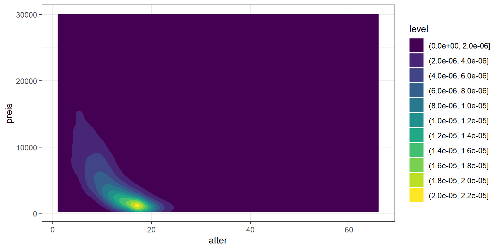


## Ästhetik-Zuordnung

Über weitere Ästhetik-Zuordnungen (Welche Variable wird durch welche Ästhetik repräsentiert?) können wir eine *mehrdimensionale* Visualisierung erstellen.

Welche Ästhetiken für `geom_point` zur Verfügung stehen, kann man via `help(geom_point)` unter der  Überschrift *Aesthetics* nachlesen.

### Kardinal-skalierte Variable
Für kardinal-sklaierte Variablen ist bspw. die Form-Ästhetik (shape) ungeeignet


```r
sample %>% ggplot(mapping = aes(x = alter, y = preis, color = ps)) + geom_point()
```

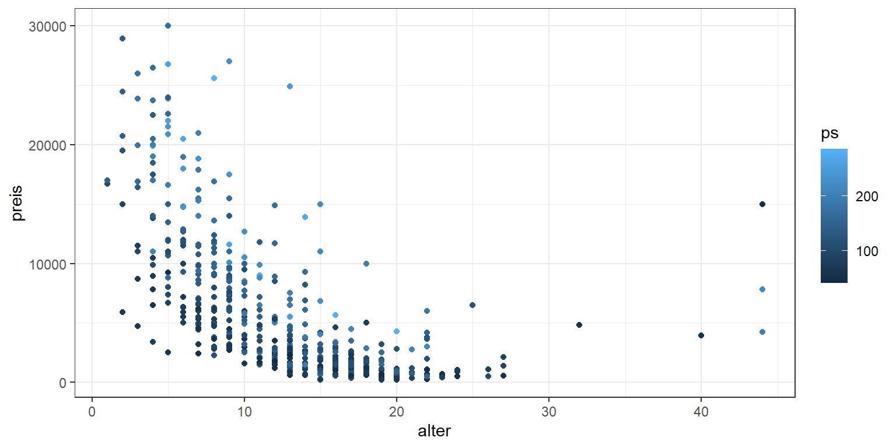

```r
sample %>% ggplot(mapping = aes(x = alter, y = preis, size = ps)) + geom_point()
```

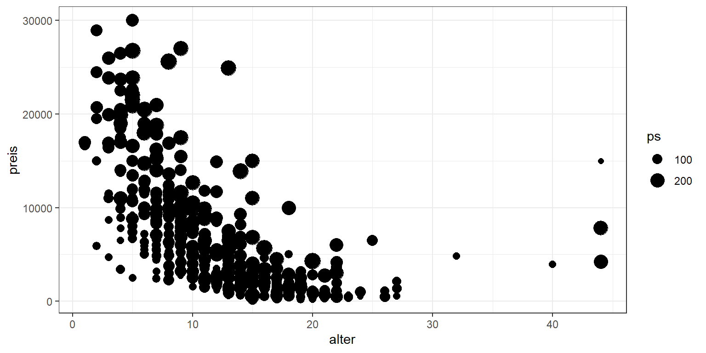

```r
sample %>% ggplot(mapping = aes(x = alter, y = preis, alpha = ps)) + geom_point()
```

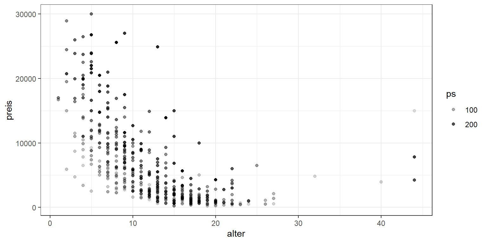

### Nominal-skalierte Variable
Für nominal-skalierte Variablen sind Größe (size) und Transparenz (alpha) wenig geeignet

```r
sample %>% ggplot(mapping = aes(x = alter, y = preis, color = fahrzeugtyp)) + geom_point()
```

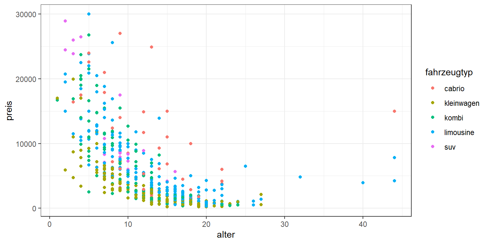

```r
sample %>% ggplot(mapping = aes(x = alter, y = preis, shape = fahrzeugtyp)) + geom_point()
```

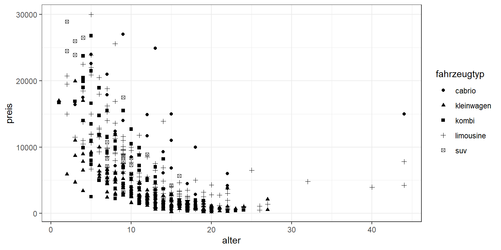

### Fixierte Ästhetik 
Beachten Sie den Unterschied zwischen (1) einer Zuordnung (aesthetic mapping) und (2) einer fest definierten Ästhetik! 

Im folgenden Beispiel werden die Ästhetiken Farbe (color), Transparenz (alpha), Größe (size) und Form (shape) auf konkrete Werte festgelegt. Das heißt für jeden dargestellten Datenpunkt wird dieselbe Farbe, Transparenz, etc. verwendet. Hingegen bekommen bei einer Ästhetik-Zuordnung die Datenpunkte unterschiedliche Farben, Transparenzen, etc. in Abhängigkeit vom Wert der jeweiligen Variable des Datensatzes. 


```r
sample %>% 
  ggplot(mapping = aes(x = alter, y = preis)) + 
  geom_point(color = "#54b856", 
              alpha = 0.5,
              size = 3, 
              shape = 18)
```

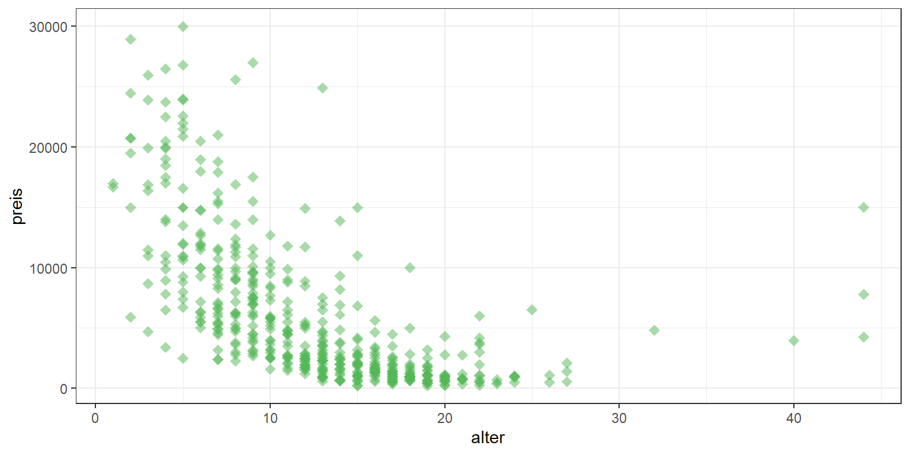
 

## Geometrisches Objekt

Grundsätzlich stehen Ihnen eine große Auswahl an Objekttypen zur Verfügung. Aber: Für eine gegebene Fragestellung kommen idR nur wenige davon konkret in Frage.

Betrachten wir, welche Objekttypen für die folgende Fragestellung sinnvoll sein könnten: *Wie stehen Fahrzeugalter und Preis miteinander in Beziehung?*


```r
p <- sample %>% ggplot(aes(x = alter, y = preis))
p + geom_point()
```


```r
p + geom_jitter()       # zufälliges "Zittern" um Überlappungen zu reduzieren
```

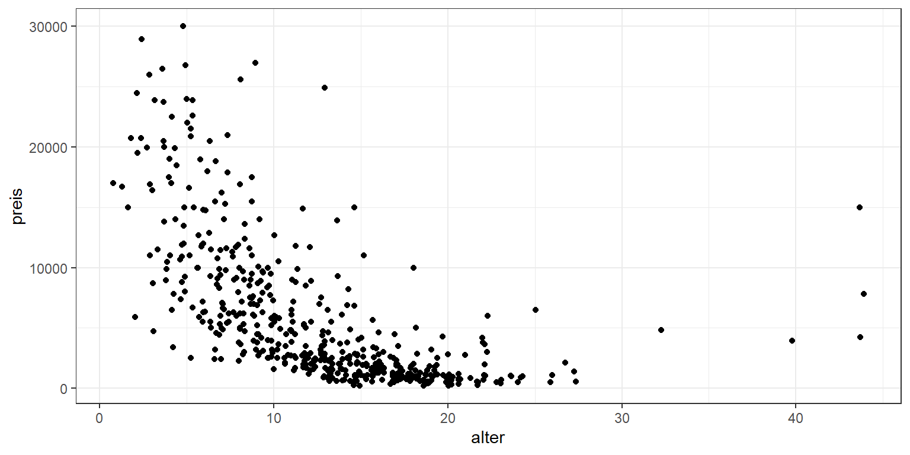

```r
p + geom_smooth()       # Geglättete Linie
```

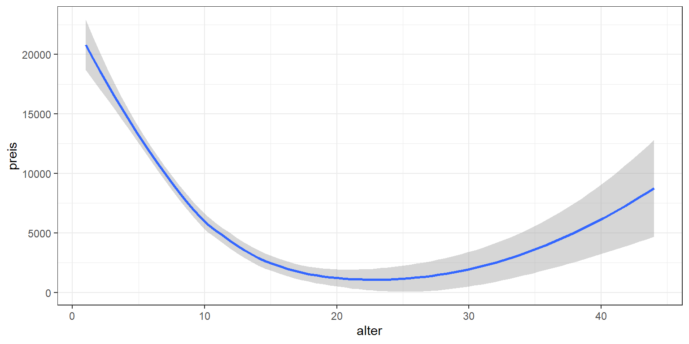

```r
p + geom_density_2d()   # Umrisse einer 2-dimensionalen Dichteschätzung
```

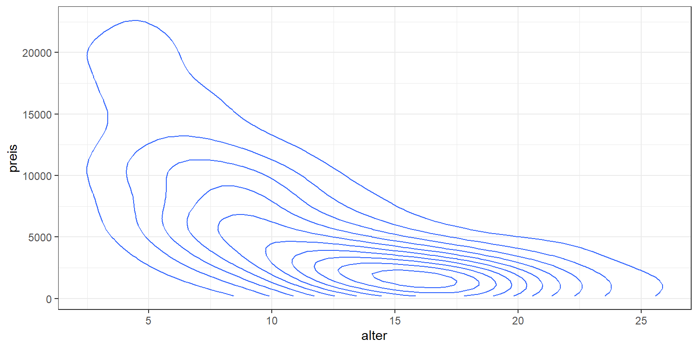

Beachten Sie, dass die `geom_[typ]` Funktionen teilweise implizite Veränderungen an den Daten vornehmen: bspw. statistische Berechnungen (`geom_smooth`, `geom_density_2d`) oder Positionsanpassungen (`geom_jitter`). Diese standardmäßig verwendeten Verändungen können Sie aber auch manuell verhindern bzw. anpassen, bspw:


```r
p + geom_smooth(method = "lm")    # Lineare Regressionsgerade
```

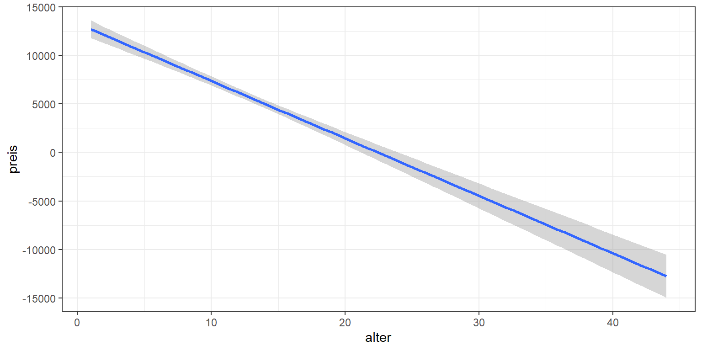

Sie können mithilfe der `geom` Funktionen auch mehrere **Datenschichten** übereinander legen. Dabei definiert jeder Objekttyp genau eine Schicht. Je Schicht können auch eigene Daten oder eine eigene Ästhetik-Zuordnung verwendet werden.

**Beispiel 1: Streudiagramm mit Smooth Line**

```r
p + geom_point() + geom_smooth()
```

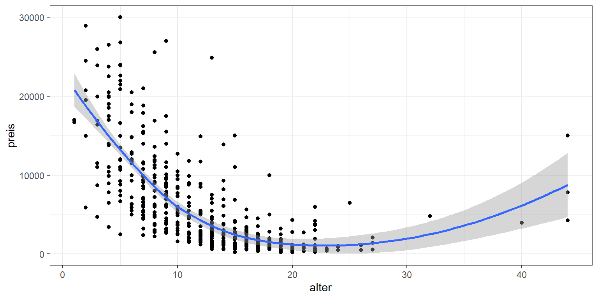

**Beipsiel 2: Hervorhebung einer Teilmenge der Daten**

```r
subset <- sample %>% filter(hersteller == "opel")
p + 
  geom_point(color = "grey", alpha = 0.2) +
  geom_point(data = subset, aes(color = hersteller))
```

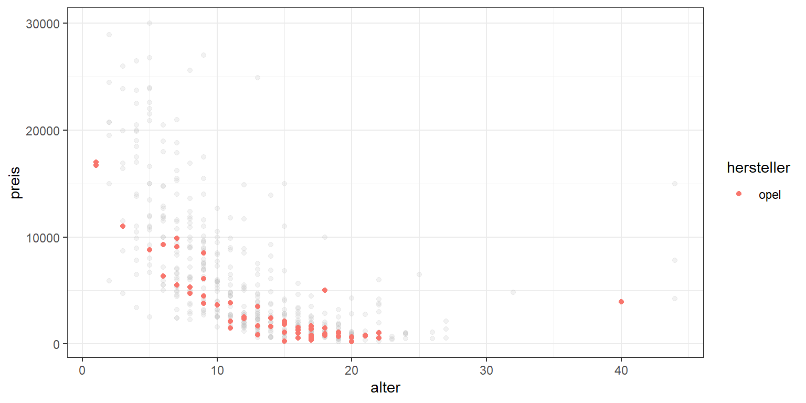

**Beispiel 3: Labels für interessante Datenpunkte**


```r
subset <- sample %>% filter(preis==max(preis) | alter==max(alter))

p + 
  geom_point() +
  ggrepel::geom_label_repel(data = subset, 
                            mapping = aes(label = name), 
                            min.segment.length = 0.1)
```

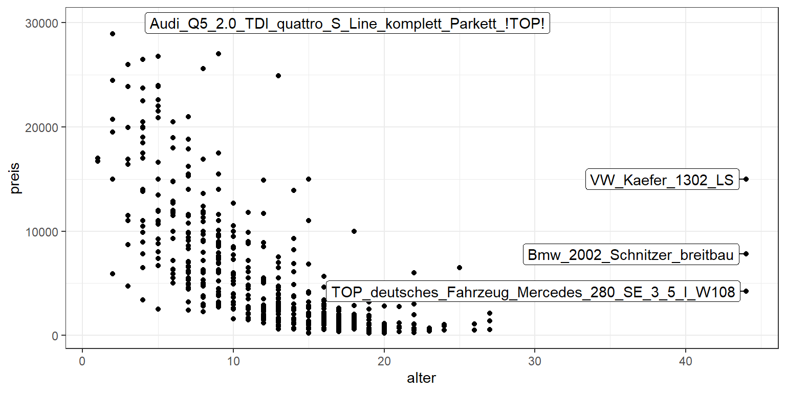

**Beispiel 4: Streudiagramm mit mehreren Smooth Lines**

```r
sample %>% 
  ggplot(mapping = aes(x = alter, y = preis, color = fahrzeugtyp)) + 
  geom_point() +
  geom_smooth(se=FALSE)
```

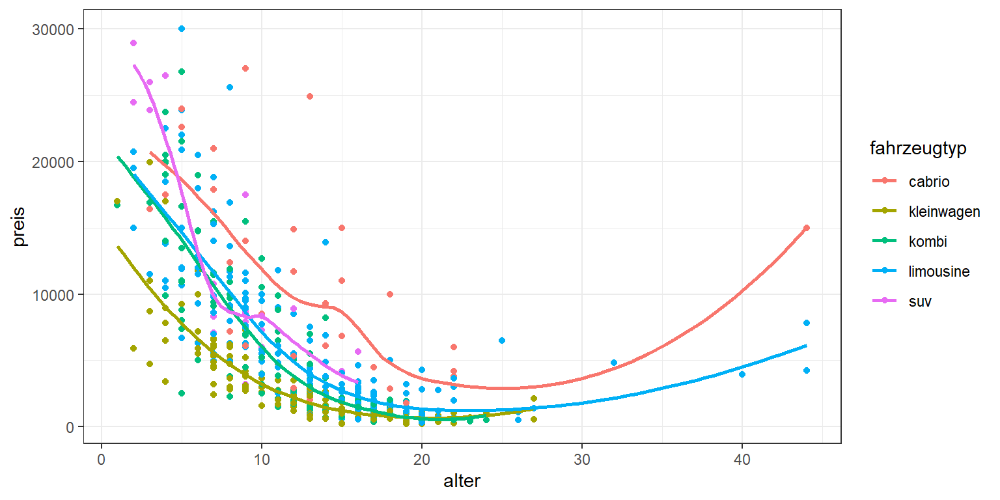

## Skalierung
Jede Ästhetik hat zunächst eine Standard-Skalierung. Diese können Sie jedoch manuell anpassen


### Axen-Skalierung: 
Wenn Datenpunkte sehr stark in einem kleinen Bereich der Grafik konzentriert sind, kann eine **logarithmische Skalierung** dabei helfen, diese Datenpunkte visuell zu entzerren.


```r
p + geom_point() + 
  geom_smooth() +
  scale_y_log10() +
  scale_x_log10()
```

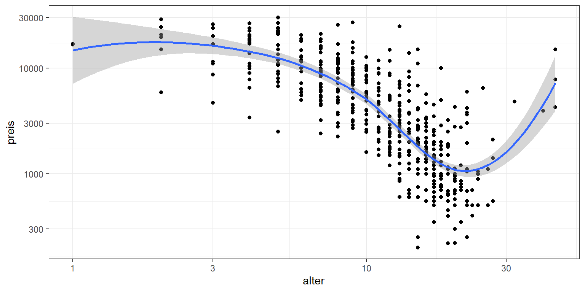


### Farb-Skalierung
Je nach Variablentyp eignen sich unterschiedliche Farbskalierungen:

**Nominal-skalierte Variable**

```r
sample %>% 
  ggplot(aes(alter, preis, color = fahrzeugtyp)) + 
  geom_point() +
  scale_color_brewer(type = "qual", palette = "Set1")
```

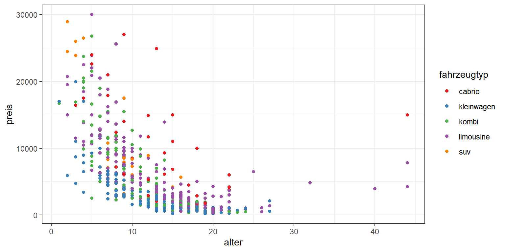
 
**Ordinal-skalierte Variable**

```r
sample %>% 
  ggplot(aes(alter, preis, color = cut_interval(ps, n = 3))) + 
  geom_point() +
  scale_color_brewer(type = "seq", palette = "Reds")
```

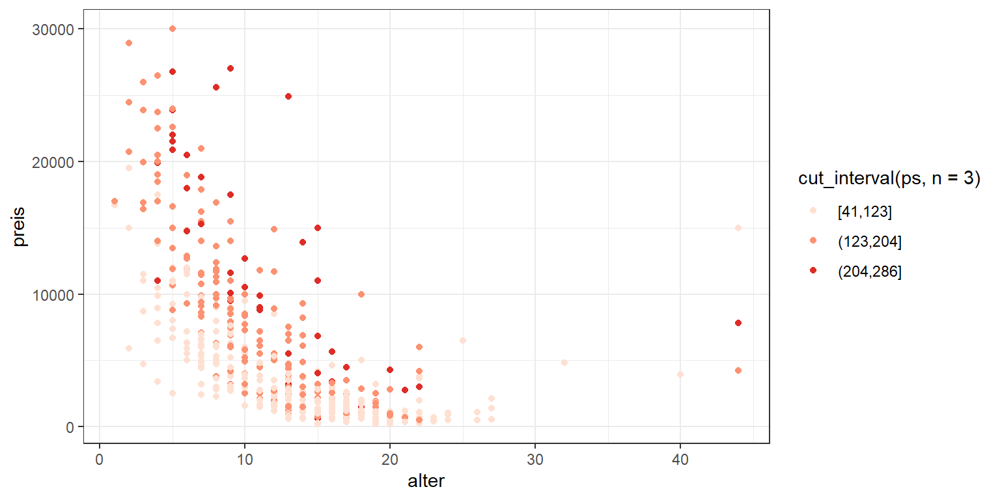

**Kardinal-skalierte Variable**

```r
sample %>% 
  ggplot(aes(alter, preis, color = ps)) + 
  geom_point() +
  scale_color_gradient(low = "white", high = "blue")
```

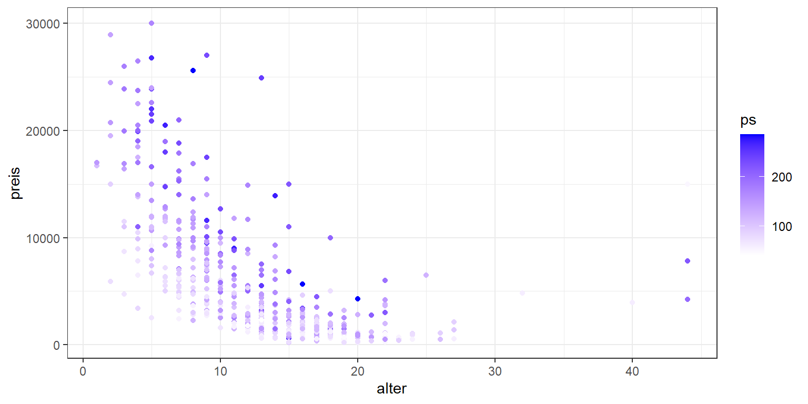

Es gibt diverse vordefinierte Farbpaletten, siehe z.B.

```r
RColorBrewer::display.brewer.all()
```

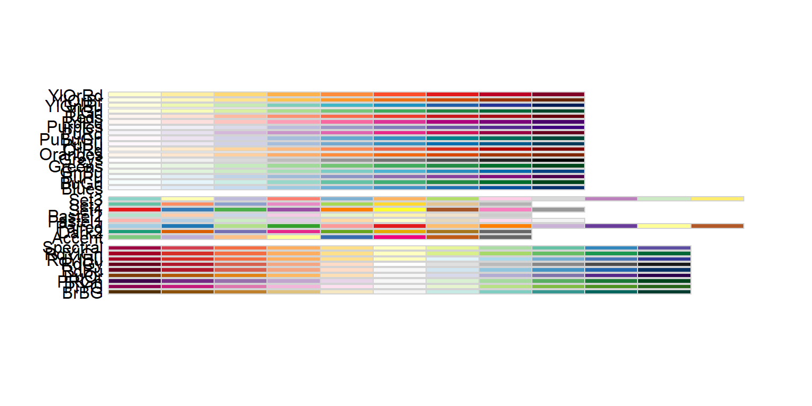

... alternativ können Farbskalierungen auch selbst definiert werden

```r
meine_palette <- c("#4ecf71", "#4e5dcf", "#cf4ecf", "#cf4e4e", "#cfa44e")
sample %>% 
  ggplot(aes(alter, preis, color = fahrzeugtyp)) + 
  geom_point() +
  scale_color_manual(values = meine_palette)  
```

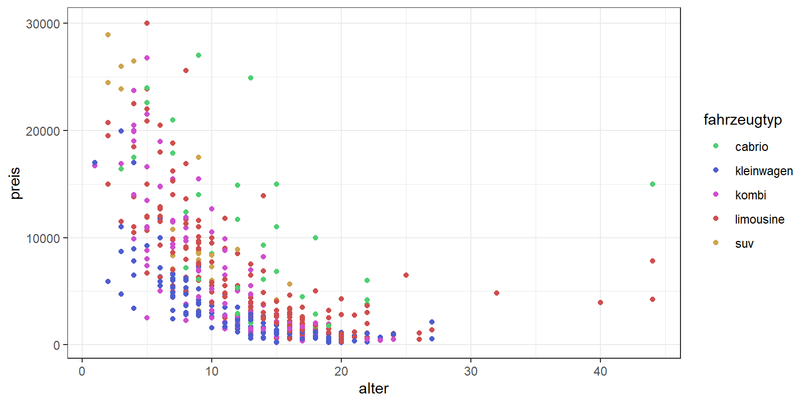


## Facetten 

"Mehrdimensionale" Plots sind oft überladen und schwer interpretierbar. **Facettenplots** sind dann eine hilfreiche Alternative.


```r
p <- sample %>% ggplot(aes(alter, preis)) + geom_point() 
p + facet_wrap(~fahrzeugtyp)
```

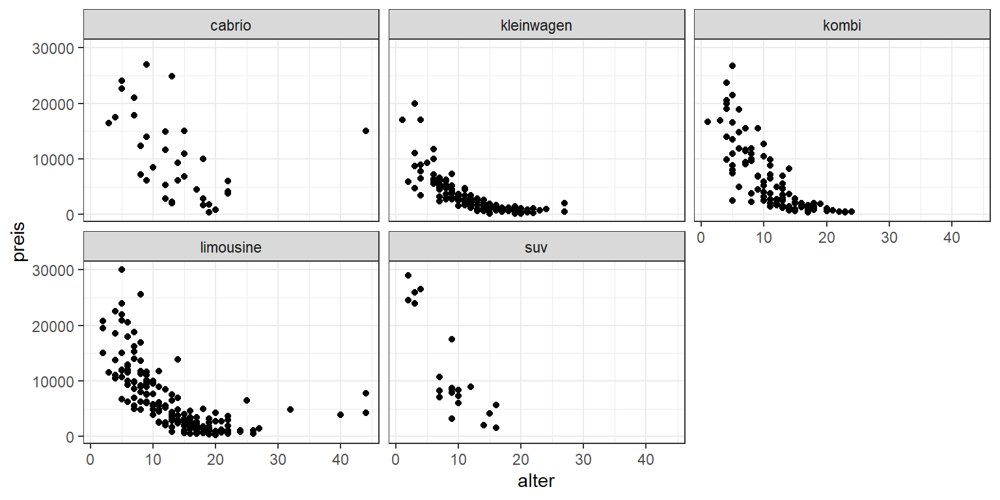

```r
p + facet_wrap(~ ps>150)
```

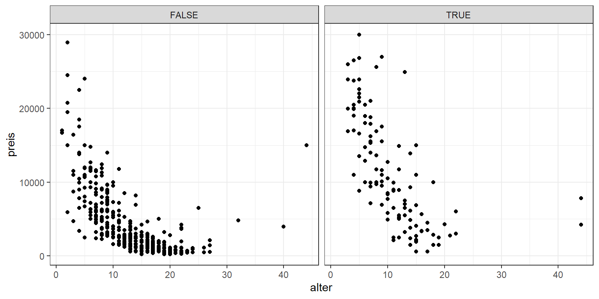

```r
p + facet_grid(fahrzeugtyp ~ ps>100)
```

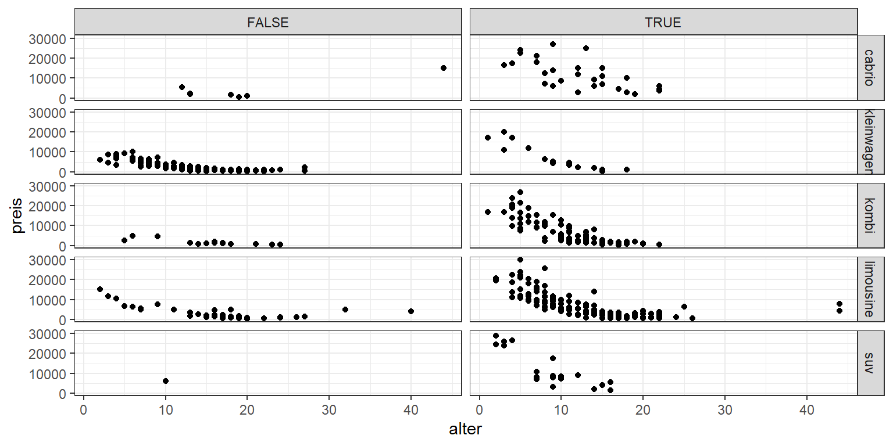

Hier können sie auch festlegen, dass jede Facette eine eigene Axenskalierung erhält

```r
p + facet_wrap(~fahrzeugtyp, scales = "free")
```

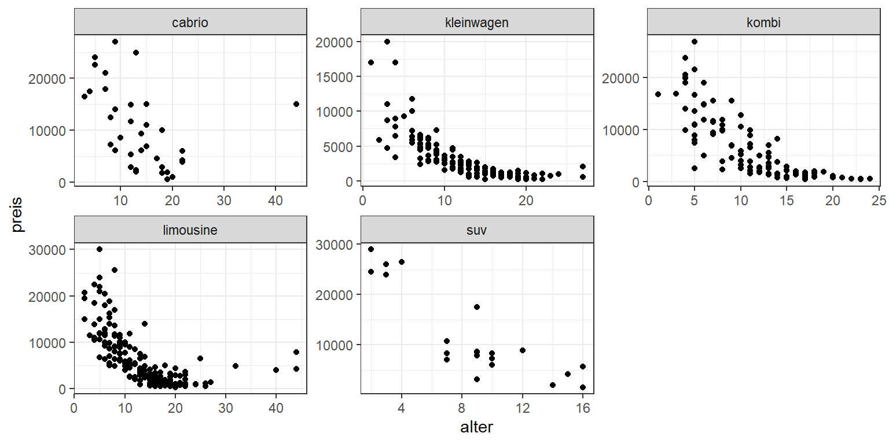

## Thema und Labels 

### Labels


```r
p + labs(x = "Alter in Jahren", y = "Preis in €", title = "Gebrauchtwagen")
```

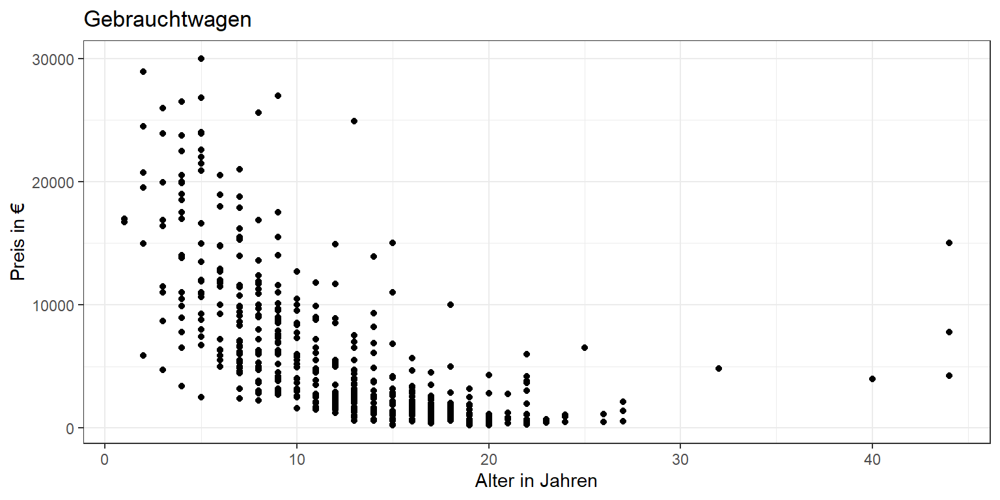

### Thema
Sie können eines der unzähligen vordefinierten Themen verwenden


```r
p + theme_classic()
```


```r
p + ggthemes::theme_economist()
```

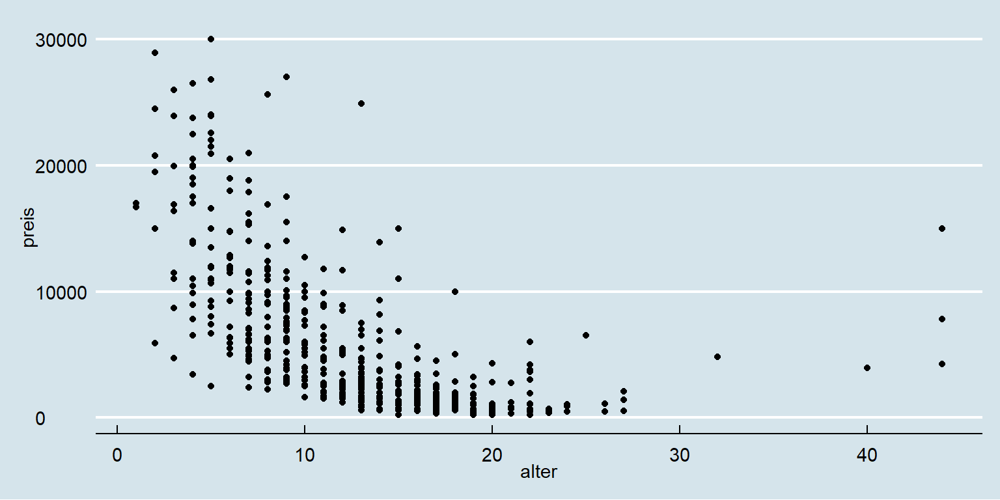

... oder im Detail ihr eigenes Thema gestalten.

```r
p + theme(plot.background = element_rect(fill = "lightgrey"),
          panel.background = element_rect(fill = "darkgrey"),
          panel.border = element_rect(size = 2),
          panel.grid = element_line(linetype = 2),
          axis.title = element_text(size = 14))
```

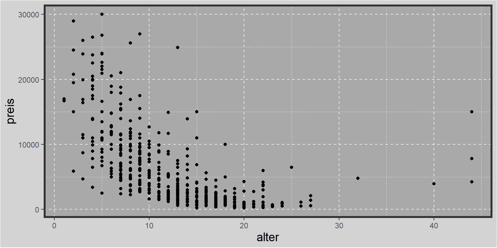

