# Streudiagramme


Alle Visualisierungen in diesem Kurs setzen wir mithilfe des Paketes **ggplot2** durch. Es handelt sich dabei um einen Bestandteil des bereits bekannten Paketes **tidyverse**. Das Paket basiert auf einer "Grammar of Graphics" (daher das "gg" in "ggplot2"), d.h. einem sprachlichen Regelwerk für die einzelnen Bestandteile einer Grafik. Dieses Regewerk kann uns dabei helfen, komplexe Sachverhalte in einfache Grafiken zu überführen. 

Wir erschließen uns das Paket ggplot2 anhand von Streudiagrammen (*scatterplots*). Steudiagrmamme sind hilfreich um die Beziehung zwischen 2 (oder mehr) Variablen zu visualisieren. 


```r
library(tidyverse)
theme_set(theme_bw())                      # Standard Thema (Hintergrund, etc.) für die Grafiken
```


```r
df <- read_csv("data/gebrauchtwagen.csv")  # Daten einlesen
sample <- df %>% slice(1:500)              # Kleiner Datensatz, der die ersten 500 Zeilen umfasst
glimpse(sample)
```

```
## Rows: 500
## Columns: 13
## $ name        <chr> "smart_forTwo_Softtouch__passion_Inspektion_fuer_687_Euro_~
## $ preis       <dbl> 5299, 1100, 8199, 8999, 3600, 2490, 15500, 2700, 6200, 279~
## $ alter       <dbl> 7, 16, 14, 8, 13, 11, 7, 12, 8, 8, 22, 8, 9, 15, 16, 18, 1~
## $ kilometer   <dbl> 30000, 125000, 150000, 150000, 150000, 150000, 150000, 900~
## $ hersteller  <chr> "smart", "renault", "audi", "mercedes_benz", "bmw", "peuge~
## $ modell      <chr> "fortwo", "clio", "a4", "c_klasse", "3er", "1_reihe", "5er~
## $ fahrzeugtyp <chr> "kleinwagen", "kleinwagen", "kombi", "limousine", "limousi~
## $ getriebe    <chr> "automatik", "manuell", "automatik", "automatik", "manuell~
## $ ps          <dbl> 71, 75, 131, 136, 116, 68, 177, 69, 125, 67, 115, 121, 129~
## $ kraftstoff  <chr> "benzin", "benzin", "benzin", "diesel", "benzin", "diesel"~
## $ schaden     <chr> "nein", "nein", "nein", "nein", "nein", "nein", "nein", "j~
## $ plz         <dbl> 35315, 36137, 85057, 10627, 65934, 14793, 28816, 30880, 71~
## $ bundesland  <chr> "Hessen", "Hessen", "Bayern", "Berlin", "Hessen", "Branden~
```

## Grundlagen

Minimale Angaben zur Erstellung einer Grafik:

- **Datensatz** (data)
- **Ästhetik-Zuordnung** (aesthetic mapping): Welche Variable des Datensatzes wird durch welche Ästhetik (x-Achse, y-Achse, Farbe, Größe, Form, ...) repräsentiert?
- **Geometrisches Objekt** (geometric object): z.B. Punkte, Linien, Balken, etc.


```r
ggplot(data = sample, mapping = aes(x = alter, y = preis)) + geom_point()
```

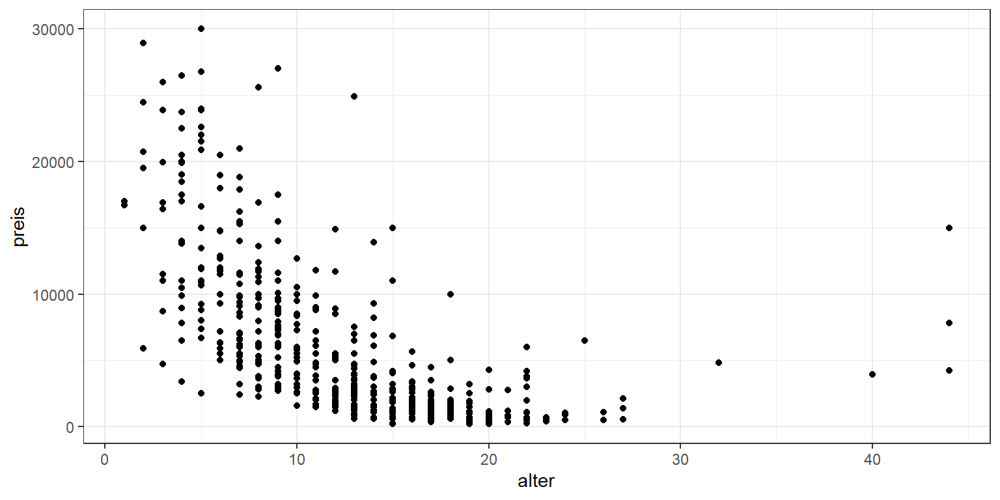

**Wie ändert sich die Grafik, wenn wir den vollen Datensatz (df) verwenden?**


```r
ggplot(data = df, mapping = aes(x = alter, y = preis)) + geom_point()
```


**Wie ändert sich die Grafik, wenn wir eine andere Ästhetik-Zuordnung vornehmen?**


```r
ggplot(data = sample, mapping = aes(x = preis, y = alter)) + geom_point()
```

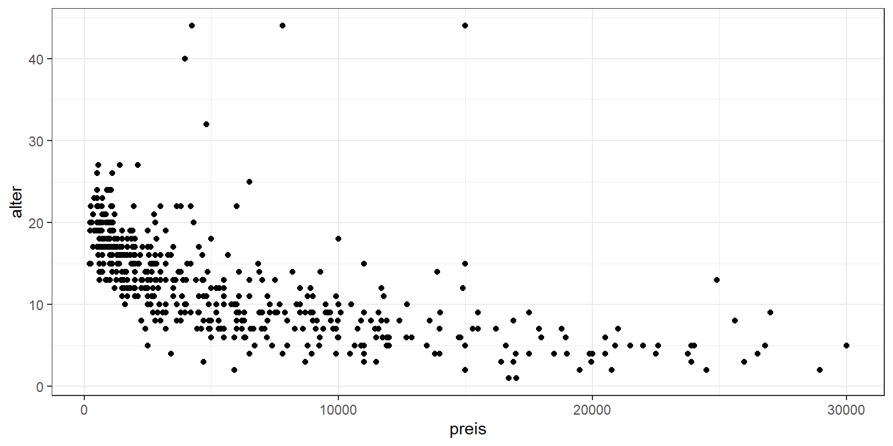

```r
ggplot(data = sample, mapping = aes(x = preis, y = hersteller)) + geom_point()
```


```r
ggplot(data = sample, mapping = aes(x = fahrzeugtyp, y = hersteller)) + geom_point()
```

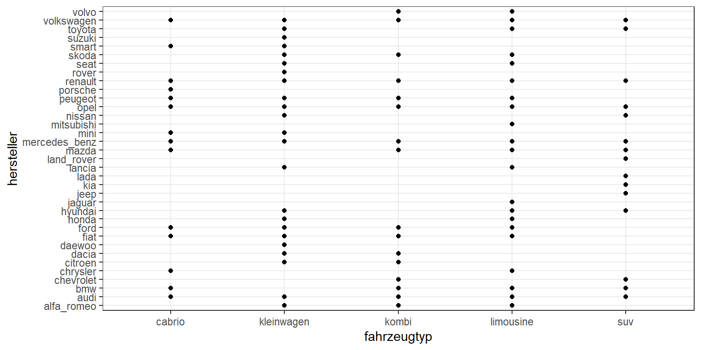


**Wie ändert sich die Grafik, wenn wir einen anderen Objekttyp wählen?**

```r
ggplot(data = sample, mapping = aes(x = fahrzeugtyp, y = hersteller)) + geom_jitter(width = 0.1)
```

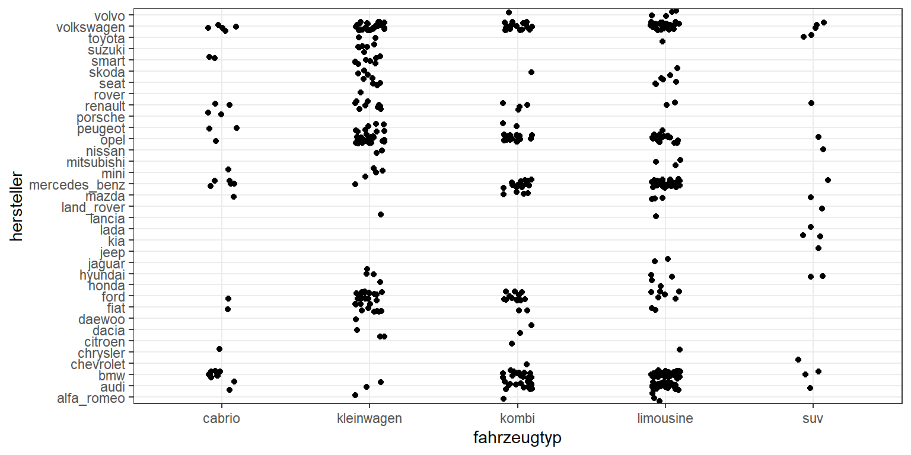

```r
ggplot(data = df, mapping = aes(x = alter, y = preis)) + geom_density2d_filled()
```


## Ästhetik-Zuordnung

Über weitere Ästhetik-Zuordnungen (Welche Variable wird durch welche Ästhetik repräsentiert?) können wir eine *mehrdimensionale* Visualisierung erstellen. Welche Ästhetiken für `geom_point` zur Verfügung stehen, kann man via `help(geom_point)` unter der  Überschrift *Aesthetics* nachlesen. Je nach Varialentyp sind unterschiedliche Ästhetiken sinnvoll.

### Kardinal-skalierte Variable
Für kardinal-skalierte Variablen wie `ps` (für Pferdestärke) sind beispielsweise die Ästhetiken Farbe (`color`), Größe (`size`) und Transparenz (`alpha`) denkbar, wobei nur die Farbe richtig überzeugt.


```r
sample %>% ggplot(mapping = aes(x = alter, y = preis, color = ps)) + geom_point()
```


```r
sample %>% ggplot(mapping = aes(x = alter, y = preis, size = ps)) + geom_point()
```

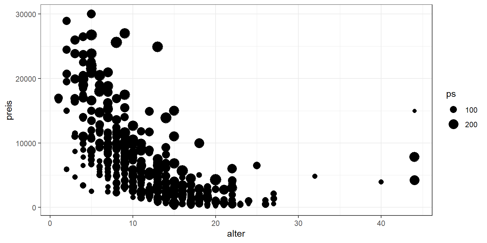

```r
sample %>% ggplot(mapping = aes(x = alter, y = preis, alpha = ps)) + geom_point()
```


### Nominal-skalierte Variable
Für nominal-skalierte Variablen wie `fahrzeugtyp` eignen sich bspw. die Ästhetiken Farbe (`color`) und Form (`shape`).

```r
sample %>% ggplot(mapping = aes(x = alter, y = preis, color = fahrzeugtyp)) + geom_point()
```

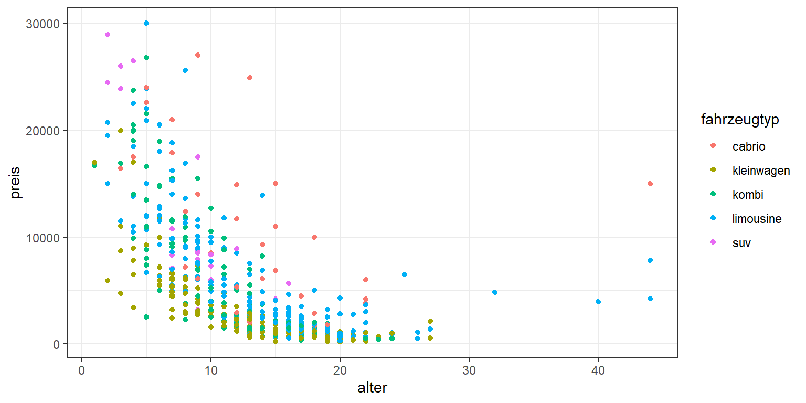

```r
sample %>% ggplot(mapping = aes(x = alter, y = preis, shape = fahrzeugtyp)) + geom_point()
```


### Fixierte Ästhetik 
Beachten Sie den Unterschied zwischen (1) einer Ästhetik-Zuordnung (aesthetic mapping) und (2) einer fest definierten Ästhetik! 

Im folgenden Beispiel werden die Ästhetiken Farbe (color), Transparenz (alpha), Größe (size) und Form (shape) auf konkrete Werte festgelegt. Das heißt für jeden dargestellten Datenpunkt wird dieselbe Farbe, Transparenz, etc. verwendet. Hingegen bekommen bei einer Ästhetik-Zuordnung die Datenpunkte unterschiedliche Farben, Transparenzen, etc. in Abhängigkeit vom Wert der jeweiligen Variable des Datensatzes. 


```r
sample %>% 
  ggplot(mapping = aes(x = alter, y = preis)) + 
  geom_point(color = "#54b856", 
              alpha = 0.5,
              size = 3, 
              shape = 18)
```


 

## Geometrisches Objekt

Grundsätzlich stehen Ihnen eine große Auswahl an Objekttypen zur Verfügung. Aber: Für eine gegebene Fragestellung kommen idR nur wenige davon konkret in Frage.

Betrachten wir, welche Objekttypen für die folgende Fragestellung sinnvoll sein könnten: *Wie stehen Fahrzeugalter und Preis miteinander in Beziehung?*


```r
p <- sample %>% ggplot(aes(x = alter, y = preis))
p + geom_point()
```


```r
p + geom_jitter()       # zufälliges "Zittern" um Überlappungen zu reduzieren
```


```r
p + geom_smooth()       # Geglättete Linie
```

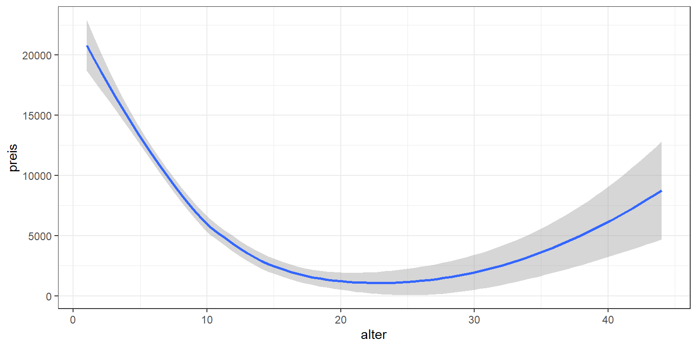

```r
p + geom_density_2d()   # Umrisse einer 2-dimensionalen Dichteschätzung
```

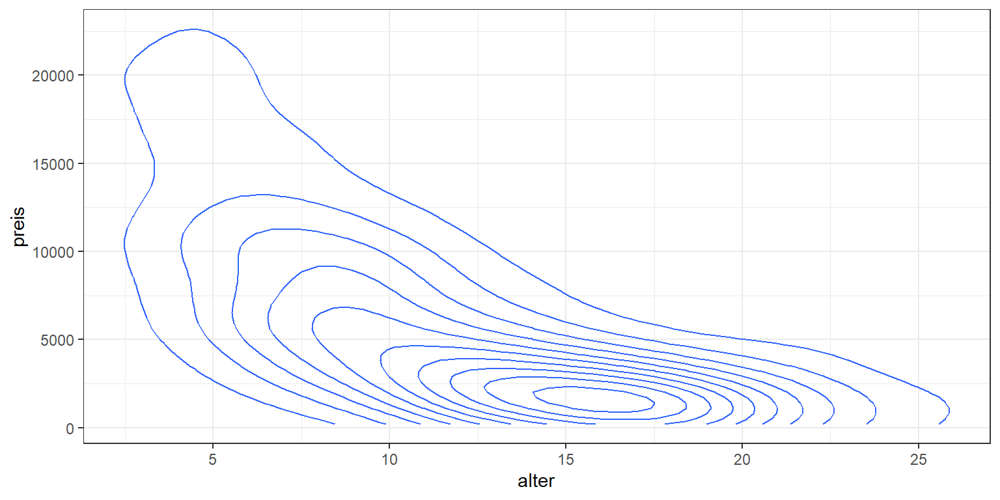

Beachten Sie, dass die `geom_[typ]` Funktionen teilweise implizite Veränderungen an den Daten vornehmen: bspw. statistische Berechnungen (`geom_smooth`, `geom_density_2d`) oder Positionsanpassungen (`geom_jitter`). Diese standardmäßig verwendeten Verändungen können Sie aber auch manuell verhindern bzw. anpassen, bspw:


```r
p + geom_smooth(method = "lm")    # Lineare Regressionsgerade
```


Sie können mithilfe der `geom` Funktionen auch mehrere **Datenschichten** übereinander legen. Dabei definiert jeder Objekttyp genau eine Schicht. Je Schicht können auch eigene Daten oder eine eigene Ästhetik-Zuordnung verwendet werden.

**Beispiel 1: Streudiagramm mit Smooth Line**

```r
p + geom_point() + geom_smooth()
```


**Beipsiel 2: Hervorhebung einer Teilmenge der Daten**

```r
subset <- sample %>% filter(hersteller == "opel")
p + 
  geom_point(color = "grey", alpha = 0.2) +
  geom_point(data = subset, aes(color = hersteller))
```


**Beispiel 3: Labels für interessante Datenpunkte**


```r
subset <- sample %>% filter(preis==max(preis) | alter==max(alter))

p + 
  geom_point() +
  ggrepel::geom_label_repel(data = subset, 
                            mapping = aes(label = name), 
                            min.segment.length = 0.1)
```


**Beispiel 4: Streudiagramm mit mehreren Smooth Lines**

```r
sample %>% 
  ggplot(mapping = aes(x = alter, y = preis, color = fahrzeugtyp)) + 
  geom_point() +
  geom_smooth(se=FALSE)
```


## Skalierung
Jede Ästhetik hat zunächst eine Standard-Skalierung. Diese können Sie jedoch manuell anpassen


### Axen-Skalierung: 
Wenn Datenpunkte sehr stark in einem kleinen Bereich der Grafik konzentriert sind, kann eine **logarithmische Skalierung** dabei helfen, diese Datenpunkte visuell zu entzerren.


```r
p + geom_point() + 
  geom_smooth() +
  scale_y_log10() +
  scale_x_log10()
```

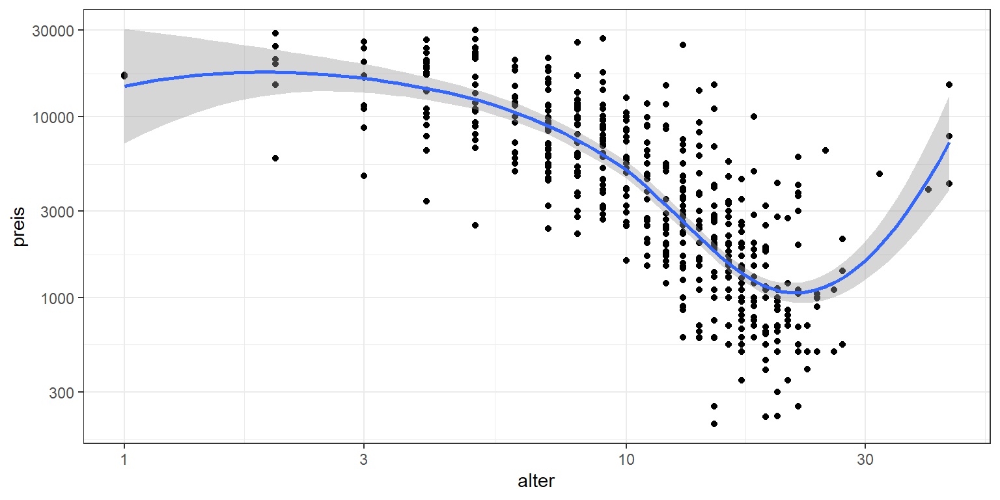


### Farb-Skalierung
Je nach Variablentyp eignen sich unterschiedliche Farbskalierungen:

**Nominal-skalierte Variable**

```r
sample %>% 
  ggplot(aes(alter, preis, color = fahrzeugtyp)) + 
  geom_point() +
  scale_color_brewer(type = "qual", palette = "Set1")
```

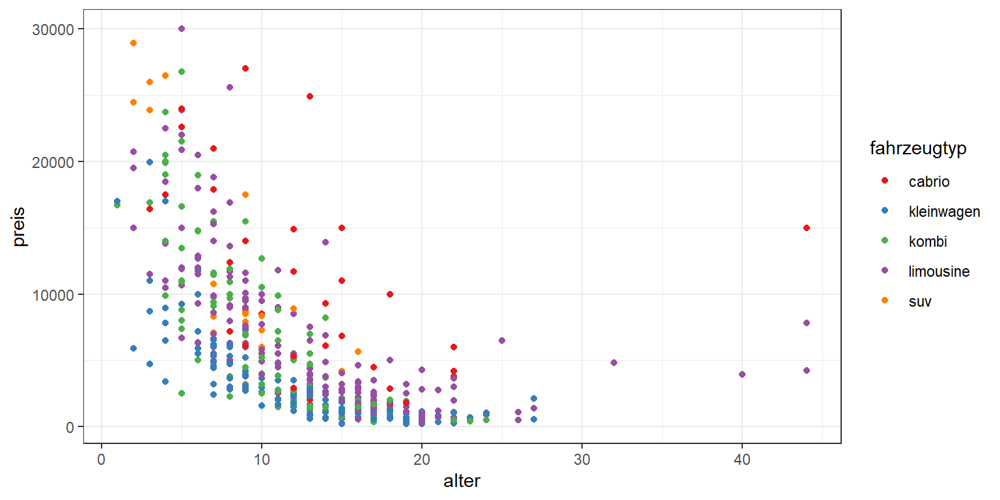
 
**Ordinal-skalierte Variable**

```r
sample %>% 
  ggplot(aes(alter, preis, color = cut_interval(ps, n = 3))) + 
  geom_point() +
  scale_color_brewer(type = "seq", palette = "Reds")
```


**Kardinal-skalierte Variable**

```r
sample %>% 
  ggplot(aes(alter, preis, color = ps)) + 
  geom_point() +
  scale_color_gradient(low = "white", high = "blue")
```


Es gibt diverse vordefinierte Farbpaletten, siehe z.B.

```r
RColorBrewer::display.brewer.all()
```


... alternativ können Farbskalierungen auch selbst definiert werden

```r
meine_palette <- c("#4ecf71", "#4e5dcf", "#cf4ecf", "#cf4e4e", "#cfa44e")
sample %>% 
  ggplot(aes(alter, preis, color = fahrzeugtyp)) + 
  geom_point() +
  scale_color_manual(values = meine_palette)  
```


## Facetten 

"Mehrdimensionale" Plots sind oft überladen und schwer interpretierbar. **Facettenplots** sind dann eine hilfreiche Alternative.


```r
p <- sample %>% ggplot(aes(alter, preis)) + geom_point() 
p + facet_wrap(~fahrzeugtyp)
```


```r
p + facet_wrap(~ ps>150)
```


```r
p + facet_grid(fahrzeugtyp ~ ps>100)
```

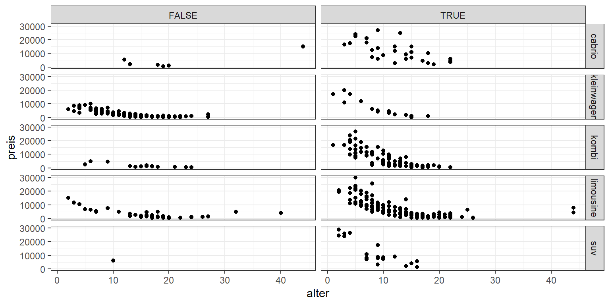

Hier können sie auch festlegen, dass jede Facette eine eigene Axenskalierung erhält

```r
p + facet_wrap(~fahrzeugtyp, scales = "free")
```


## Thema und Labels 

### Labels


```r
p + labs(x = "Alter in Jahren", y = "Preis in €", title = "Gebrauchtwagen")
```


### Thema
Sie können eines der unzähligen vordefinierten Themen verwenden


```r
p + theme_classic()
```


```r
p + ggthemes::theme_economist()
```

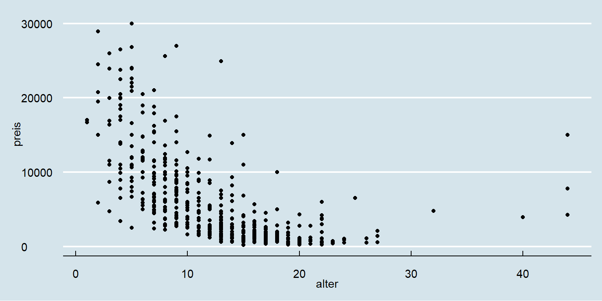

... oder im Detail ihr eigenes Thema gestalten.

```r
p + theme(plot.background = element_rect(fill = "lightgrey"),
          panel.background = element_rect(fill = "darkgrey"),
          panel.border = element_rect(size = 2),
          panel.grid = element_line(linetype = 2),
          axis.title = element_text(size = 14))
```


