# Geodaten

Visualisierung von Geodaten


```r
library(tidyverse)   
library(sf)          
theme_set(
  theme_bw() + 
  theme(panel.background = element_blank(), panel.spacing = unit(0, "lines"),
        plot.background = element_blank(),
        legend.justification = c(0, 0), legend.position = c(0, 0), legend.background = element_blank())
)
```

## Simple Features


```r
df <- read_rds("data/wdi.rds")        # Einlesen der Daten
df <- df %>% filter(jahr==2018)       # Einschränkung auf das aktuellste Jahr im Datensatz
head(df)
```

```
## Simple feature collection with 6 features and 23 fields
## geometry type:  MULTIPOLYGON
## dimension:      XY
## bbox:           xmin: -61.88711 ymin: 16.99717 xmax: 74.89131 ymax: 42.64795
## CRS:            +proj=longlat +datum=WGS84 +no_defs +ellps=WGS84 +towgs84=0,0,0
## # A tibble: 6 x 24
##   iso2c land         kontinent   subregion    jahr bevölkerung bevölkerung_weib~
##   <chr> <chr>        <chr>       <chr>       <int>       <dbl>             <dbl>
## 1 AD    Andorra      Europe      Southern E~  2018       77006              NA  
## 2 AE    United Arab~ Asia        Western As~  2018     9630959              30.6
## 3 AF    Afghanistan  Asia        Southern A~  2018    37172386              48.6
## 4 AG    Antigua and~ North Amer~ Caribbean    2018       96286              51.8
## 5 AL    Albania      Europe      Southern E~  2018     2866376              49.1
## 6 AM    Armenia      Asia        Western As~  2018     2951776              53.0
## # ... with 17 more variables: bevölkerung_0_14 <dbl>, bevölkerung_65+ <dbl>,
## #   bevölkerung_land <dbl>, bevölkerung_stadt <dbl>,
## #   bevölkerung_unter$5.50 <dbl>, bruttosozialprodukt <dbl>, fläche <dbl>,
## #   lebenserwartung <dbl>, lebenserwartung_mann <dbl>,
## #   lebenserwartung_frau <dbl>, kindersterblichkeit <dbl>, geburtenrate <dbl>,
## #   co2_emissionen <dbl>, literacy_rate <dbl>, militärausgaben <dbl>,
## #   mordrate <dbl>, geometry <MULTIPOLYGON [°]>
```

Es handelt sich nicht um einen gewöhnlichen R Datensatz (data frame), sondern um einen sogenannten **Simple Feature** Datensatz. Das besondere daran ist die Variable `geometry`, welche die Koordinaten (Längengrad und Breitengrad) der Ländergrenzen enthält.

Analog zum bisherigen Vorgehen, benötigen wir für die Visualisierung einer Weltkarte nur 3 Dinge: (1) den (Simple Feature) Datensatz, (2) eine Ästhetikzuordnung (die Variable `geometry` wird der Ästhetik **geometry** zugeordet, und (3) den passenden Objecttyp `geom_sf`. 


```r
ggplot(data = df, mapping = aes(geometry = geometry)) + geom_sf()
```

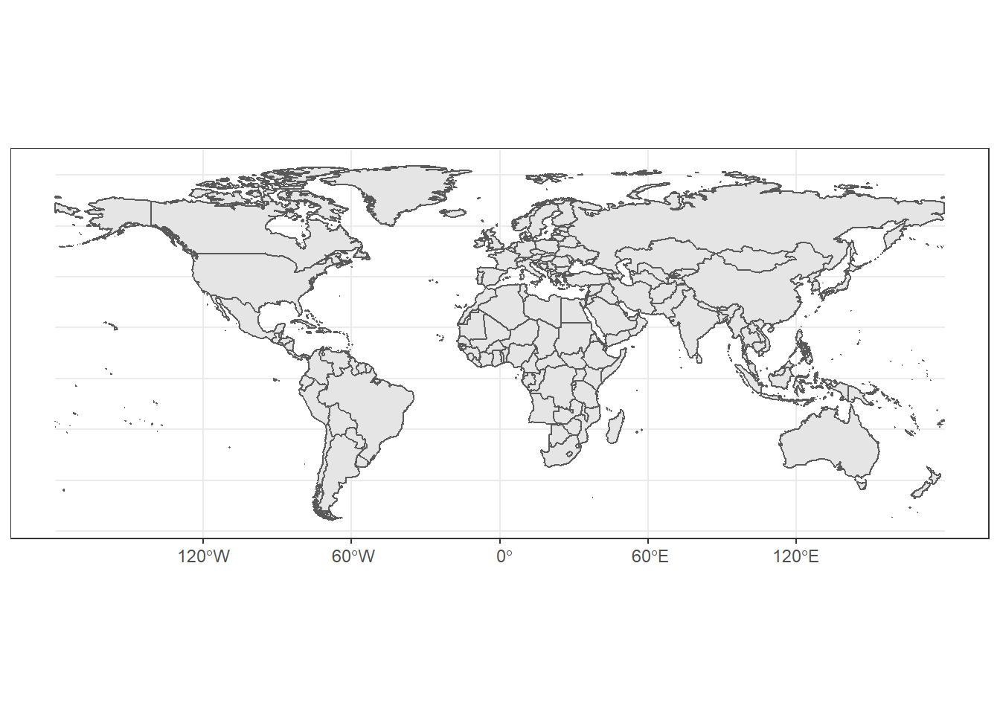

Tatsächlich können wir hier die Ästhetikzuordnung sogar weglassen, die Spezifikation des Datensatzes und `geom_sf` ist hier sogar ausreichend.


```r
ggplot(df) + geom_sf()
```

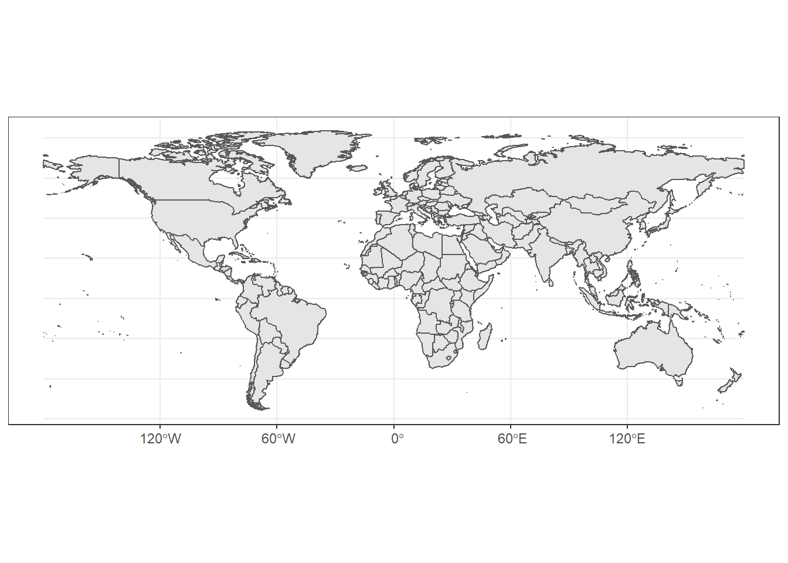

**Was bedeutet der Begriff feature?** Ein Feature kann grundsätzlich alles mögliche sein (Land, Fluss, Bushaltestelle), in unserem Fall ist es ein Land. Features können durch unterschiedliche Geometrien repräsentiert werden: eine Bushaltestelle durch einen **Punkt**, ein Fluss durch eine **Linie**, ein Land durch ein **Polygon** oder **Multipolygon**. Beispielsweise kann das "Vereinigte Königreich" nur durch einen Multipolygon repräsentiert werden, da es aus zwei Inseln (jeweils Polygone) besteht.


```r
uk <- df %>% filter(land == "United Kingdom")
ggplot(uk) + geom_sf()
```

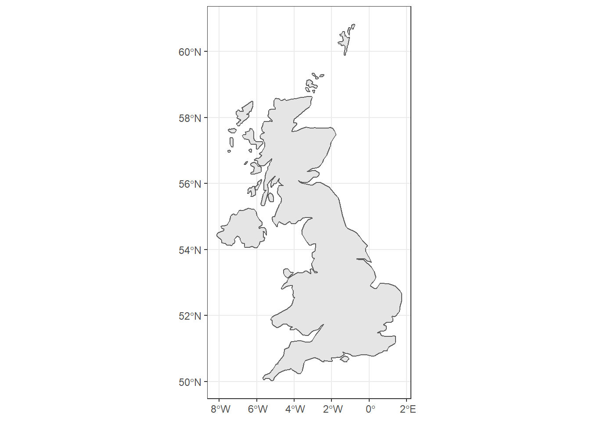

```r
uk[["geometry"]][[1]][[1]]        # Dies sind die Koordinaten von Irland
```

```
## [[1]]
##            [,1]     [,2]
##  [1,] -1.065576 50.69023
##  [2,] -1.149365 50.65571
##  [3,] -1.175830 50.61523
##  [4,] -1.196094 50.59922
##  [5,] -1.251465 50.58882
##  [6,] -1.306299 50.58853
##  [7,] -1.515332 50.66978
##  [8,] -1.563428 50.66611
##  [9,] -1.515674 50.70332
## [10,] -1.385840 50.73354
## [11,] -1.312793 50.77349
## [12,] -1.144238 50.73472
## [13,] -1.065576 50.69023
```

## Ästhetiken

Die wichtigste Ästhetik ist bei Karten in der Regel die Füllfarbe (`fill`). Wie bisher können sie sie entweder die Füllfarbe entweder auf eine bestimmte Ausprägung (bspw. "red") fixieren, oder eine Variable des Datensatzes der Füllfarbe zuordnen (*aesthetic mapping*). Zu beachten: Die Farbe der Landesgrenzen können über `color` Ästhetik beeinflusst werden. 


```r
map <- df %>% ggplot()                   
map + geom_sf(aes(fill=kontinent))                    # nominal-skalierte Variable
```

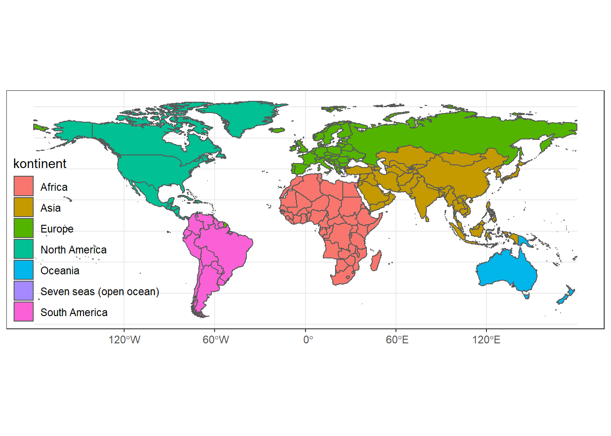

```r
map + geom_sf(aes(fill=lebenserwartung))              # kardinal-skalierte Variable
```

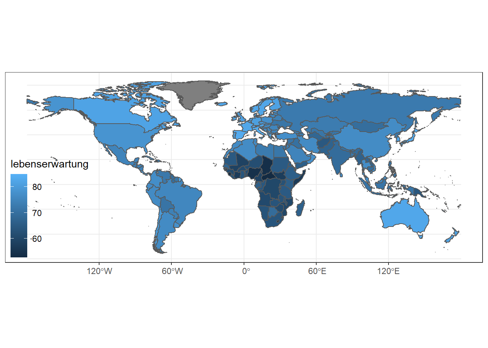

```r
map + geom_sf(aes(fill=lebenserwartung), color = NA)  # fest definierte Länderfarbe (hier unsichtbar)
```

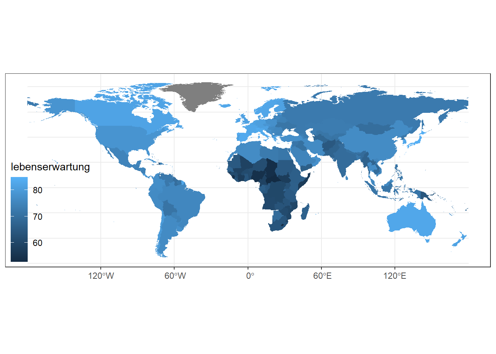

## Schichten
Wie bisher können Sie auch hier über zusätzliche `geom_[typ]` Funktionen weitere Schichten definieren. Dies ist auch hier insbesondere für Hervorhebungen hilfreich.


```r
auswahl <- df %>% filter(land %in% c("Germany", "Brazil", "China", "South Africa")) 

map + 
  geom_sf(aes(fill=kontinent)) +
  geom_sf_label(data = auswahl, aes(label=land)) 
```

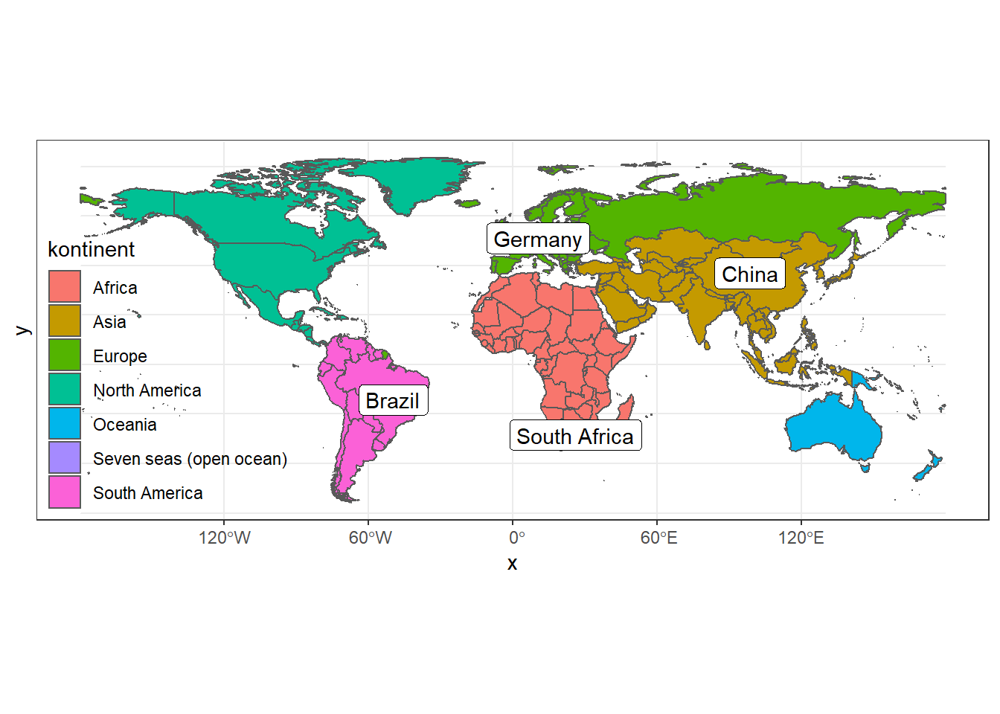

## Aggregation
In manchen Situationen möchten wir die Daten durch eine Aggregation verdichten, bspw. um die durchschnittliche Lebenserwartung je Kontinent zu berechnen. 


```r
kontinente <- df %>% 
  group_by(kontinent) %>%
  summarise(lebenserwartung = mean(lebenserwartung, na.rm=TRUE)) 
kontinente
```

```
## Simple feature collection with 7 features and 2 fields
## geometry type:  MULTIPOLYGON
## dimension:      XY
## bbox:           xmin: -180 ymin: -55.8917 xmax: 180 ymax: 83.59961
## CRS:            +proj=longlat +datum=WGS84 +no_defs +ellps=WGS84 +towgs84=0,0,0
## # A tibble: 7 x 3
##   kontinent       lebenserwartung                                       geometry
##   <chr>                     <dbl>                             <MULTIPOLYGON [°]>
## 1 Africa                     63.4 (((-2.938306 5.124495, -2.94834 5.118848, -3.~
## 2 Asia                       74.3 (((122.9489 -10.90928, 122.8559 -10.90967, 12~
## 3 Europe                     79.3 (((55.79736 -21.33936, 55.65615 -21.36904, 55~
## 4 North America              76.0 (((-78.89834 8.274268, -78.91812 8.231934, -7~
## 5 Oceania                    73.4 (((158.8788 -54.70977, 158.8452 -54.74922, 15~
## 6 Seven seas (op~            75.3 (((57.65127 -20.48486, 57.5248 -20.51318, 57.~
## 7 South America              74.9 (((-67.5752 -55.88965, -67.61143 -55.8917, -6~
```

Die gute Nachricht: bei der Aggregation wird auch die `geometry` Variable so aktualisiert, dass diese nun die Umrisse der jeweiligen Kontinente repräsentiert. 


```r
kontinente %>% ggplot() + geom_sf(aes(fill = lebenserwartung), color = NA)
```

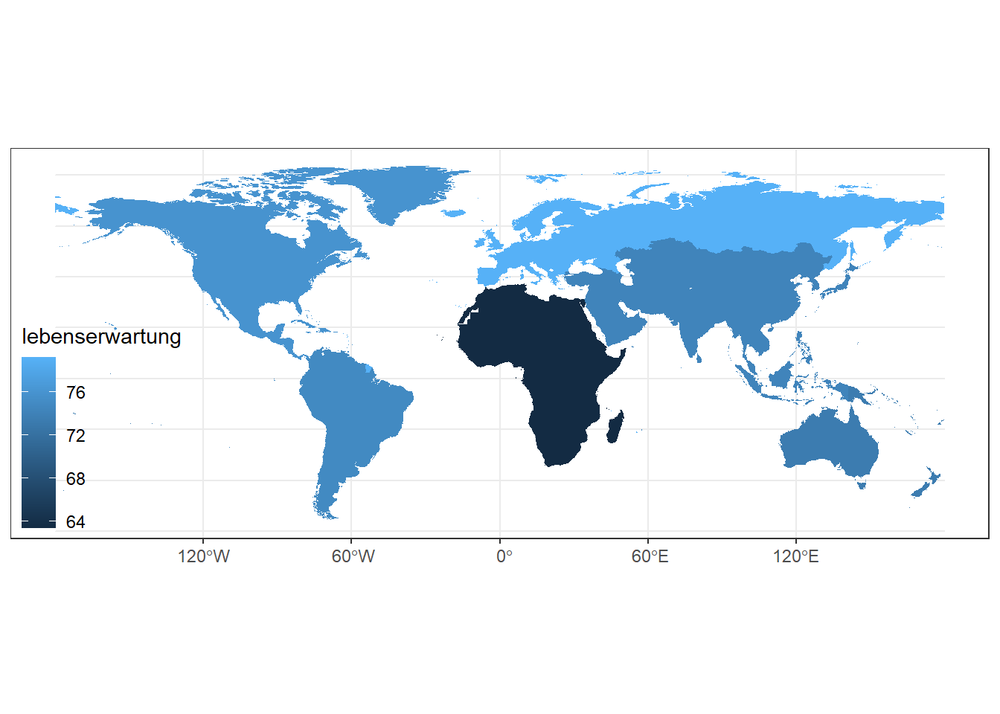

## Koordinatensystem                         

Bisher haben wir das Thema **Koordinatensystem** nicht explizit angesprochen. Im Kontext von Karten ist es aber besonders relevant, da unsere 3-dimensionale Erde nicht akurat in 2 Dimensionen dargestellt werden kann. Es stehen uns nun unterschiedlich Projektionen zu Verfügung, die jeweils vorgeben, wo die Längen- und Breitengrade in den zwei Dimensionn verortet werden.


Betrachten wir nun folgende Basiskarte:


```r
(basiskarte <- df %>% 
  ggplot() + 
  geom_sf(aes(fill = kontinent), color = NA) +
  scale_fill_brewer(palette = "Set1"))
```

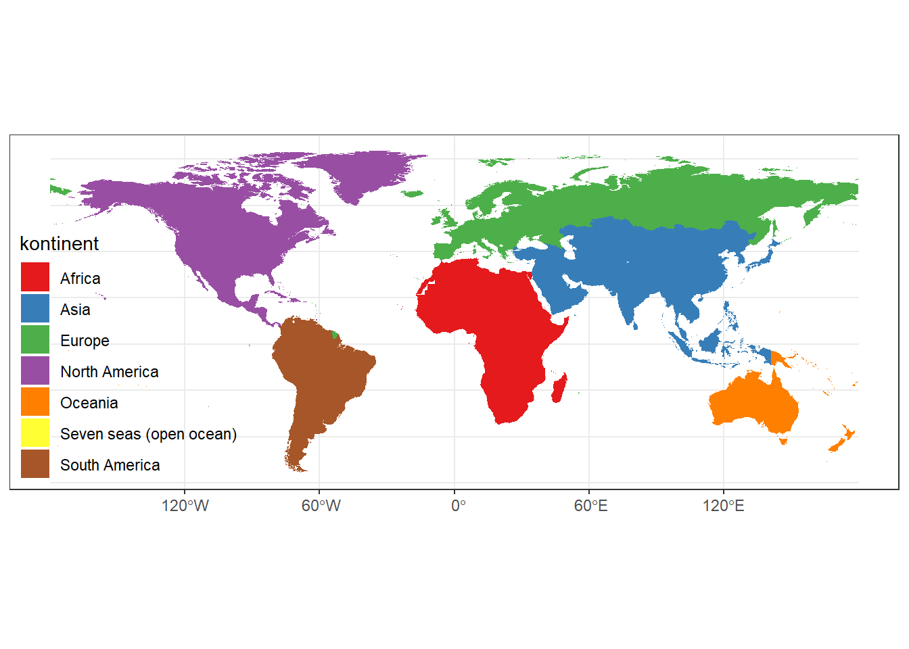

Die **Mercator Projection** stellt Formen und Winkel korrekt dar, aber in Richtung der Pole wird die Größe der Länder künstlich aufgebläht. 


```r
basiskarte + coord_sf(crs = st_crs("+proj=merc")) 
```

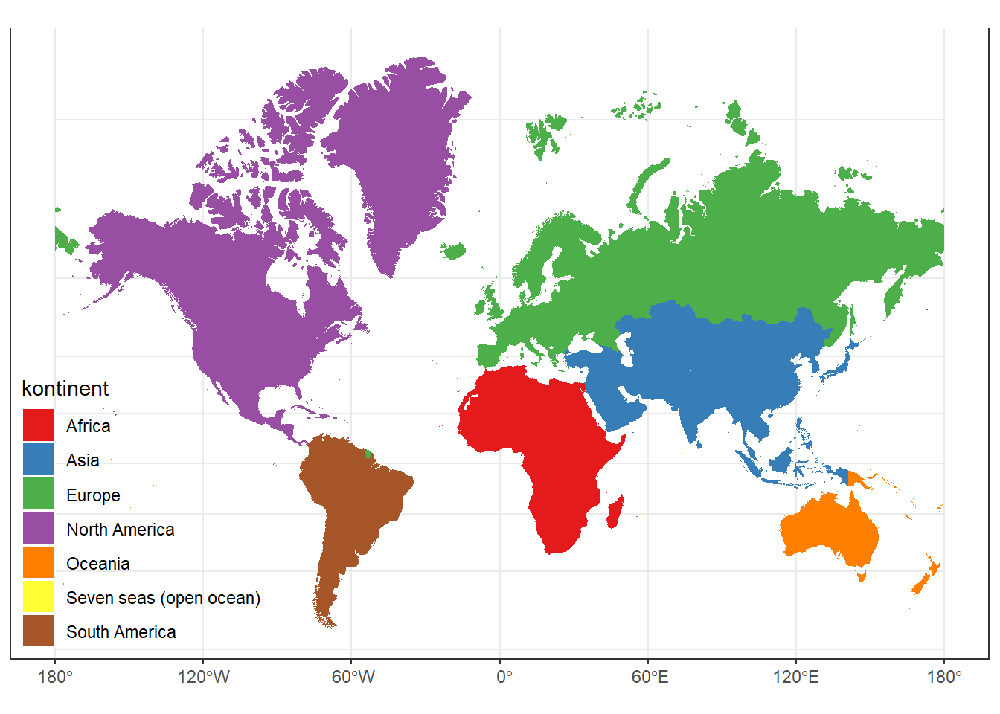

Hingegen werden bei der **Lambert Azimuthal Equal Area** (LAEA) Projektion die Ländergrößen korrekt dargestellt, wobei aber eine Verzerrung der Formen und Winkel in Kauf genommen wird. Auch der Perspektivwechsel auf einen anderen Mittelpunkt (hier Lhasa, Tibet) kann einen Mehrwert bzgl. der Interpretation schaffen. 


```r
basiskarte + coord_sf(crs = st_crs("+proj=laea + lat_0=29.6490404 + lon_0=91.0052352"))
```

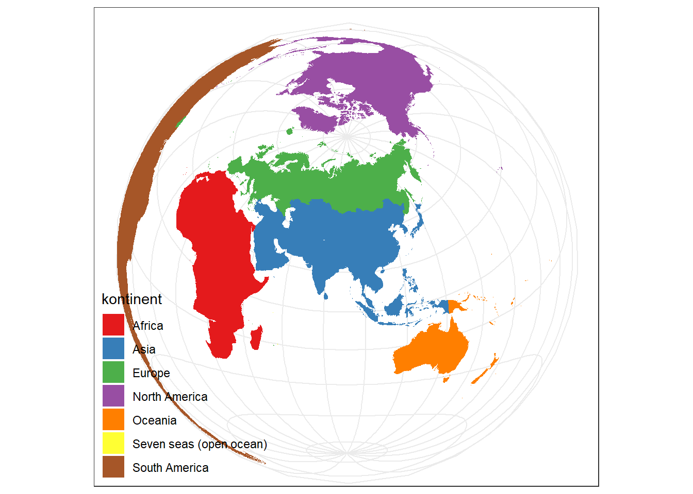

