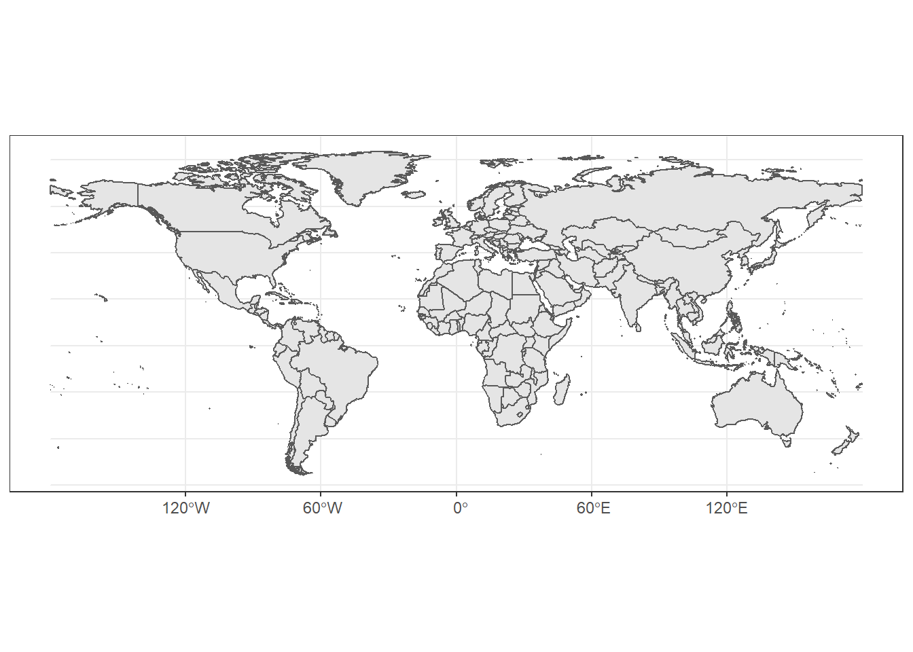
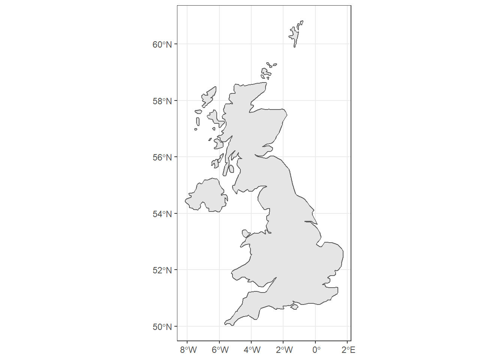
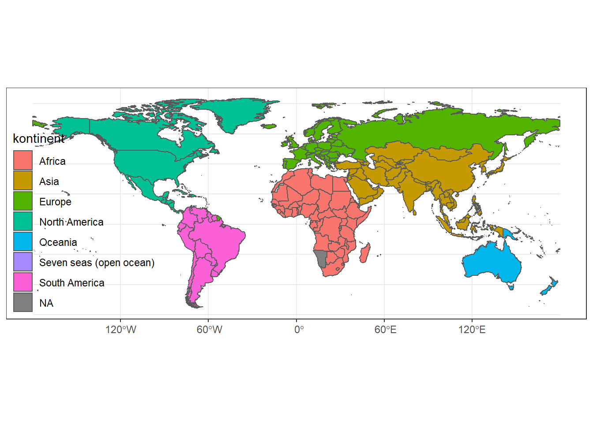
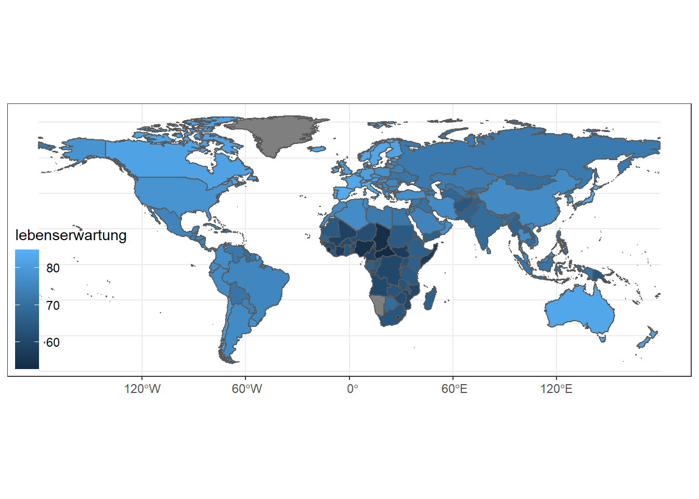
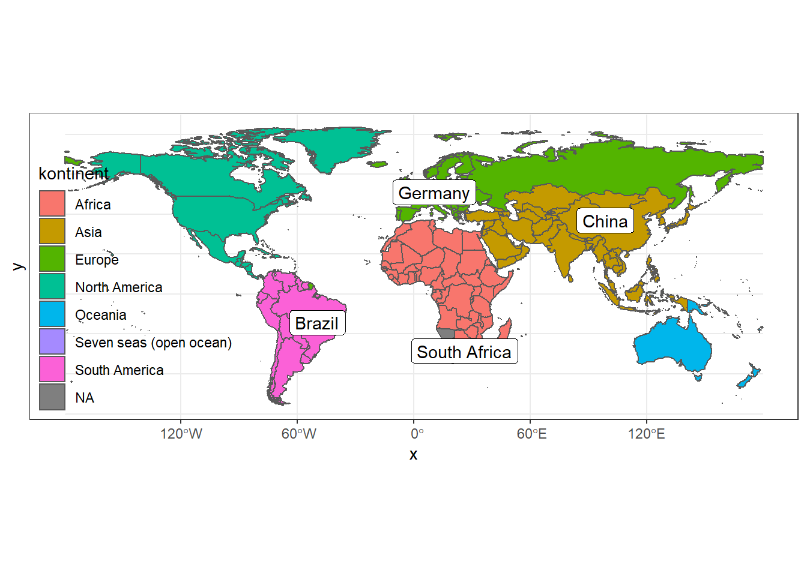
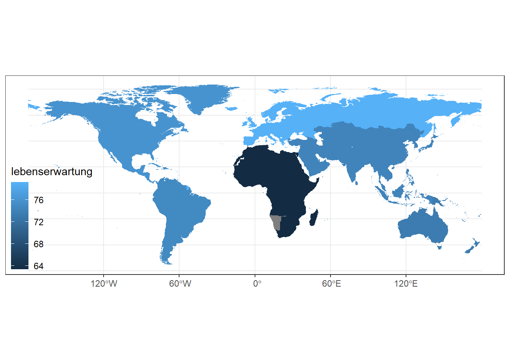
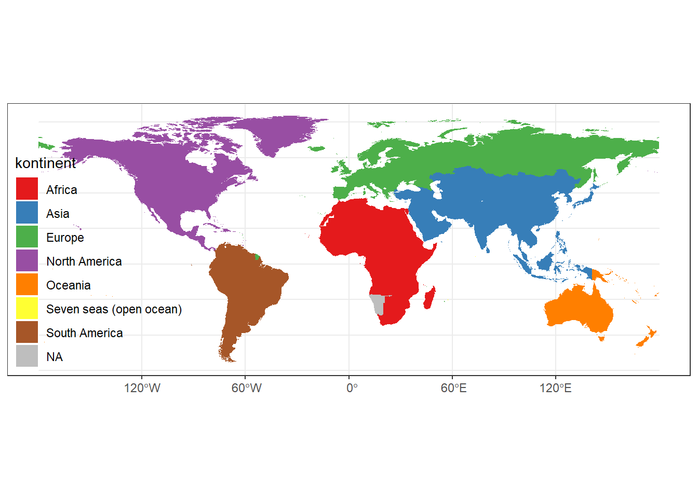
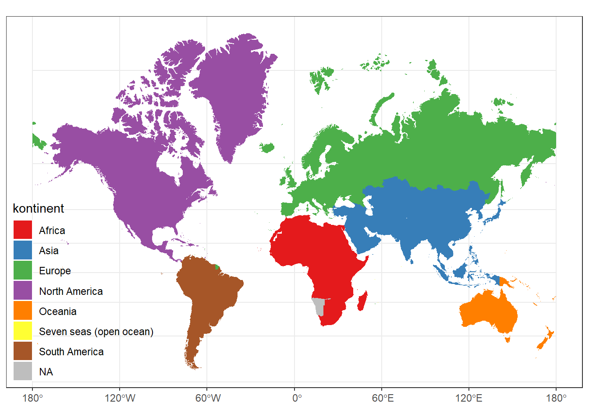
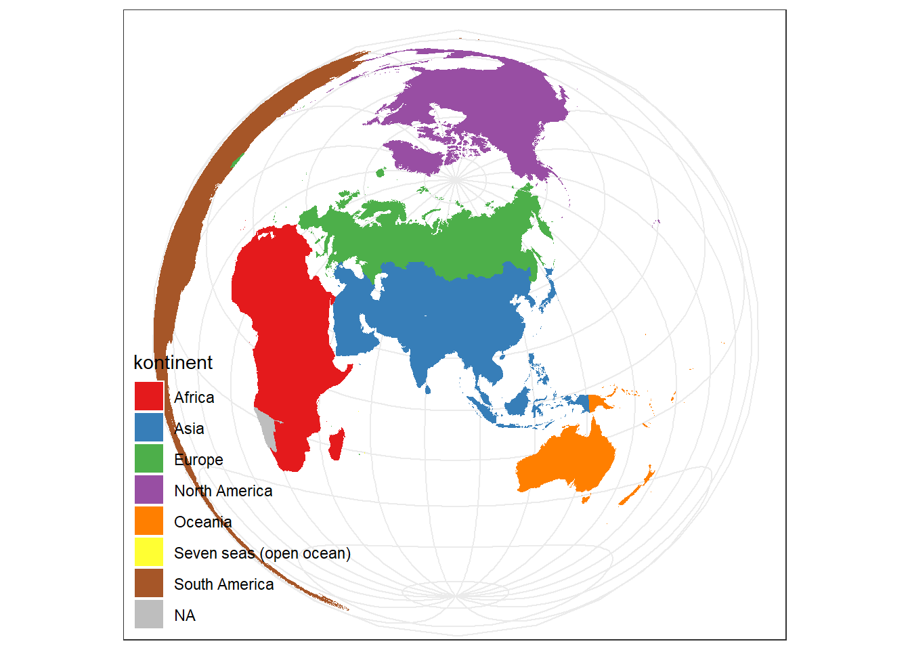

# Geodaten

Das Thema Visualisierung von **Geodaten** erschließen wir uns anhand von Daten der Weltbank aus der Reihe der **World Development Indicators**. Enthalten sind in den Daten alle Länder der Erde und ausgewählte Indikatoren seit 1990. Da die Zeitkomponente für das Verständnis nicht relevant ist, beschränken wir uns in der Folge auf das Jahr 2018 (für 2019 und 2020 fehlen noch viele Werte, daher wurden diese nicht berücksichtigt.)


```r
library(tidyverse)   
library(sf)          
theme_set(
  theme_bw() + 
  theme(panel.background = element_blank(), panel.spacing = unit(0, "lines"),
        plot.background = element_blank(),
        legend.justification = c(0, 0), legend.position = c(0, 0), legend.background = element_blank())
)
```

## Simple Features


```r
wdi <- read_csv("data/wdi.csv")        # Einlesen der World Development Indicators
wdi <- wdi %>% filter(jahr==2018)      # Einschränkung auf das aktuellste Jahr im 
geo <- read_rds("data/geo_wdi.rds")    # Einlesen der Geodaten
sf_use_s2(FALSE)
```

```
## Spherical geometry (s2) switched off
```

```r
# Geodaten werden per Join zum Datensatz hinzugefügt
df <- wdi %>% right_join(geo, by = "iso2c") %>% st_as_sf()

glimpse(df)
```

```
## Rows: 213
## Columns: 25
## $ iso2c                     <chr> "AD", "AE", "AF", "AG", "AL", "AM", "AO", "A~
## $ land                      <chr> "Andorra", "United Arab Emirates", "Afghanis~
## $ kontinent                 <chr> "Europe", "Asia", "Asia", "North America", "~
## $ subregion                 <chr> "Southern Europe", "Western Asia", "Southern~
## $ jahr                      <dbl> 2018, 2018, 2018, 2018, 2018, 2018, 2018, 20~
## $ bevoelkerung              <dbl> 77006, 9630959, 37172386, 96286, 2866376, 29~
## $ bevoelkerung_weiblich     <dbl> NA, 30.63669, 48.63585, 51.78850, 49.06309, ~
## $ bevoelkerung_0_14         <dbl> NA, 14.60351, 43.09018, 22.08109, 17.67287, ~
## $ `bevoelkerung_65+`        <dbl> NA, 1.085001, 2.584927, 8.799826, 13.744736,~
## $ bevoelkerung_land         <dbl> 11.938, 13.478, 74.505, 75.401, 39.681, 36.8~
## $ bevoelkerung_stadt        <dbl> 88.062, 86.522, 25.495, 24.599, 60.319, 63.1~
## $ `bevoelkerung_unter$5.50` <dbl> NA, 0.1, NA, NA, NA, 42.5, 88.5, 12.3, NA, 1~
## $ bruttosozialprodukt       <dbl> 3.218316e+09, 4.222150e+11, 1.835388e+10, 1.~
## $ flaeche                   <dbl> 470.0, 98647.9, 652860.0, 440.0, 28750.0, 29~
## $ lebenserwartung           <dbl> NA, 77.81400, 64.48600, 76.88500, 78.45800, ~
## $ lebenserwartung_mann      <dbl> NA, 77.133, 63.047, 75.721, 76.816, 71.215, ~
## $ lebenserwartung_frau      <dbl> NA, 79.164, 66.026, 77.983, 80.167, 78.354, ~
## $ kindersterblichkeit       <dbl> 2.9, 6.5, 48.0, 6.0, 8.5, 11.0, 51.9, 8.7, N~
## $ geburtenrate              <dbl> NA, 1.413, 4.473, 1.994, 1.617, 1.755, 5.519~
## $ co2_emissionen            <dbl> NA, NA, NA, NA, NA, NA, NA, NA, NA, NA, NA, ~
## $ literacy_rate             <dbl> NA, NA, 43.01972, NA, 98.14115, NA, NA, 99.0~
## $ militaerausgaben          <dbl> NA, NA, 198074729, NA, 175886689, 608854650,~
## $ mordrate                  <dbl> NA, NA, 6.6555612, NA, 2.2894924, 1.6939156,~
## $ iso3c                     <chr> "AND", "ARE", "AFG", "ATG", "ALB", "ARM", "A~
## $ geometry                  <MULTIPOLYGON [°]> MULTIPOLYGON (((1.706055 42...,~
```

Es handelt sich nicht um einen gewöhnlichen R Datensatz (data frame), sondern um einen sogenannten **Simple Feature** Datensatz. Das besondere daran ist die Variable `geometry`, welche die Koordinaten (Längengrad und Breitengrad) der Ländergrenzen enthält.

Analog zum bisherigen Vorgehen, benötigen wir für die Visualisierung einer Weltkarte nur 3 Dinge: (1) den (Simple Feature) Datensatz, (2) eine Ästhetikzuordnung (die Variable `geometry` wird der Ästhetik **geometry** zugeordet, und (3) den passenden Objecttyp `geom_sf`. Tatsächlich können wir hier die Ästhetikzuordnung sogar weglassen, die Spezifikat-m ion des Datensatzes und `geom_sf` ist hier sogar ausreichend.


```r
ggplot(df) + geom_sf()
```



**Was bedeutet der Begriff feature?** Ein Feature kann grundsätzlich alles mögliche sein (Land, Fluss, Bushaltestelle), in unserem Fall ist es ein Land. Features können durch unterschiedliche Geometrien repräsentiert werden: eine Bushaltestelle durch einen **Punkt**, ein Fluss durch eine **Linie**, ein Land durch ein **Polygon** oder **Multipolygon**. Beispielsweise kann das "Vereinigte Königreich" nur durch einen Multipolygon repräsentiert werden, da es aus zwei Inseln (jeweils Polygone) besteht.


```r
uk <- df %>% filter(land == "United Kingdom")
ggplot(uk) + geom_sf()
```



```r
uk[["geometry"]][[1]][[1]]        # Dies sind die Koordinaten von Irland
```

```
## [[1]]
##            [,1]     [,2]
##  [1,] -1.065576 50.69023
##  [2,] -1.149365 50.65571
##  [3,] -1.175830 50.61523
##  [4,] -1.196094 50.59922
##  [5,] -1.251465 50.58882
##  [6,] -1.306299 50.58853
##  [7,] -1.515332 50.66978
##  [8,] -1.563428 50.66611
##  [9,] -1.515674 50.70332
## [10,] -1.385840 50.73354
## [11,] -1.312793 50.77349
## [12,] -1.144238 50.73472
## [13,] -1.065576 50.69023
```

## Ästhetiken

Die wichtigste Ästhetik ist bei Karten in der Regel die Füllfarbe (`fill`). Wie bisher können sie sie entweder die Füllfarbe entweder auf eine bestimmte Ausprägung (bspw. "red") fixieren, oder eine Variable des Datensatzes der Füllfarbe zuordnen (*aesthetic mapping*). Zu beachten: Die Farbe der Landesgrenzen können über `color` Ästhetik beeinflusst werden. 


```r
map <- df %>% ggplot()                   
map + geom_sf(aes(fill=kontinent))                    # nominal-skalierte Variable
```



```r
map + geom_sf(aes(fill=lebenserwartung))              # kardinal-skalierte Variable
```



## Schichten
Wie bisher können Sie auch hier über zusätzliche `geom_[typ]` Funktionen weitere Schichten definieren. Dies ist auch hier insbesondere für Hervorhebungen hilfreich.


```r
auswahl <- df %>% filter(land %in% c("Germany", "Brazil", "China", "South Africa")) 

map + 
  geom_sf(aes(fill=kontinent)) +
  geom_sf_label(data = auswahl, aes(label=land)) 
```



## Aggregation
In manchen Situationen möchten wir die Daten durch eine Aggregation verdichten, bspw. um die durchschnittliche Lebenserwartung je Kontinent zu berechnen. 


```r
kontinente <- df %>% 
  group_by(kontinent) %>%
  summarise(lebenserwartung = mean(lebenserwartung, na.rm=TRUE)) 
kontinente
```

```
## Simple feature collection with 8 features and 2 fields
## Geometry type: MULTIPOLYGON
## Dimension:     XY
## Bounding box:  xmin: -180 ymin: -55.8917 xmax: 180 ymax: 83.59961
## CRS:           +proj=longlat +datum=WGS84 +no_defs +ellps=WGS84 +towgs84=0,0,0
## # A tibble: 8 x 3
##   kontinent       lebenserwartung                                       geometry
##   <chr>                     <dbl>                             <MULTIPOLYGON [°]>
## 1 Africa                     63.4 (((37.78955 -46.8375, 37.87285 -46.88545, 37.~
## 2 Asia                       74.3 (((121.883 -10.59033, 121.8331 -10.60215, 121~
## 3 Europe                     79.3 (((45.13477 -12.70918, 45.15879 -12.71299, 45~
## 4 North America              76.0 (((-81.67144 7.523438, -81.71045 7.485547, -8~
## 5 Oceania                    73.4 (((169.1782 -52.49727, 169.2335 -52.54824, 16~
## 6 Seven seas (op~            75.3 (((57.3833 -20.50371, 57.32832 -20.45, 57.317~
## 7 South America              74.9 (((-67.83408 -55.82754, -67.76206 -55.81611, ~
## 8 <NA>                      NaN   (((23.38066 -17.64062, 23.59492 -17.59941, 23~
```

Die gute Nachricht: bei der Aggregation wird auch die `geometry` Variable so aktualisiert, dass diese nun die Umrisse der jeweiligen Kontinente repräsentiert. 


```r
kontinente %>% ggplot() + geom_sf(aes(fill = lebenserwartung), color = NA)
```



## Koordinatensystem                         

Bisher haben wir das Thema **Koordinatensystem** nicht explizit angesprochen. Im Kontext von Karten ist es aber besonders relevant, da unsere 3-dimensionale Erde nicht akurat in 2 Dimensionen dargestellt werden kann. Es stehen uns nun unterschiedlich Projektionen zu Verfügung, die jeweils vorgeben, wo die Längen- und Breitengrade in den zwei Dimensionn verortet werden.


Betrachten wir nun folgende Basiskarte:


```r
(basiskarte <- df %>% 
  ggplot() + 
  geom_sf(aes(fill = kontinent), color=NA) +
  scale_fill_brewer(palette = "Set1", na.value = "grey"))
```



Die **Mercator Projection** stellt Formen und Winkel korrekt dar, aber in Richtung der Pole wird die Größe der Länder künstlich aufgebläht. 


```r
basiskarte + coord_sf(crs = st_crs("+proj=merc")) 
```



Hingegen werden bei der **Lambert Azimuthal Equal Area** (LAEA) Projektion die Ländergrößen korrekt dargestellt, wobei aber eine Verzerrung der Formen und Winkel in Kauf genommen wird. Auch der Perspektivwechsel auf einen anderen Mittelpunkt (hier Lhasa, Tibet) kann einen Mehrwert bzgl. der Interpretation schaffen. 


```r
basiskarte + coord_sf(crs = st_crs("+proj=laea + lat_0=29.6490404 + lon_0=91.0052352"))
```



