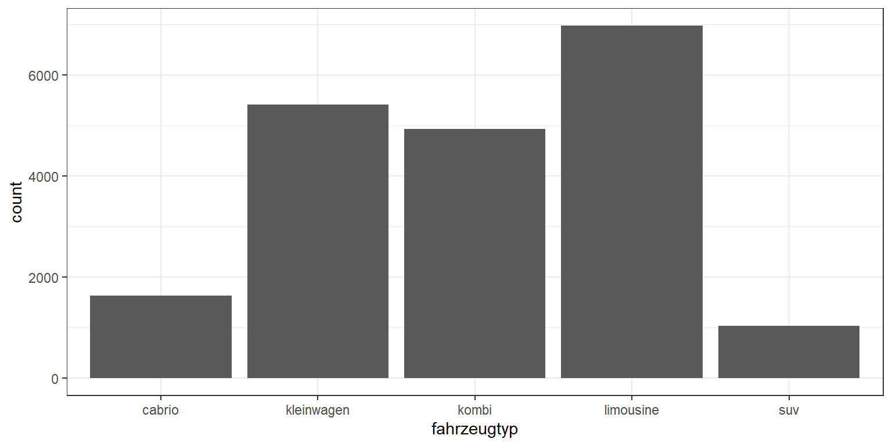
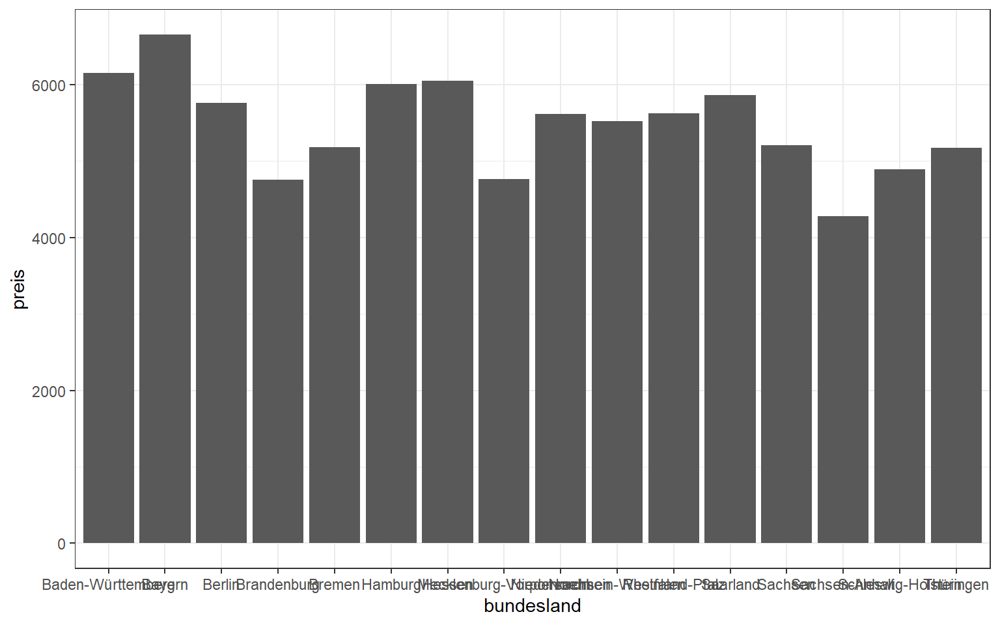
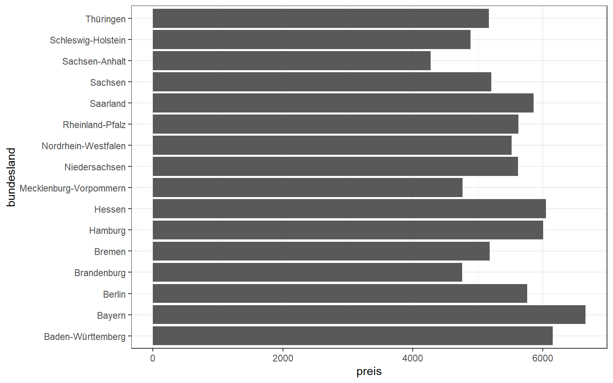
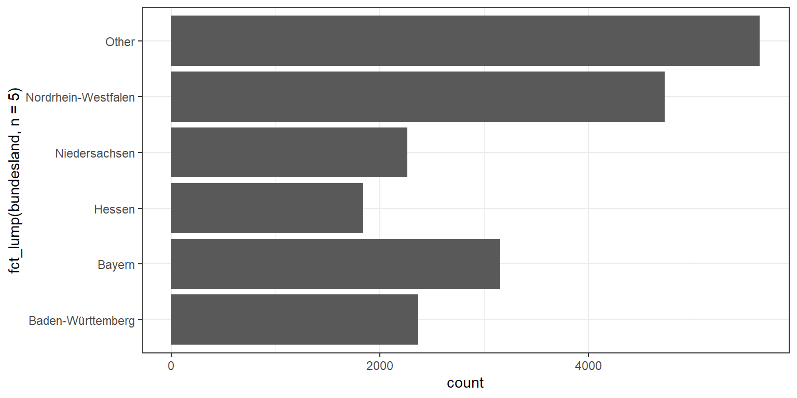
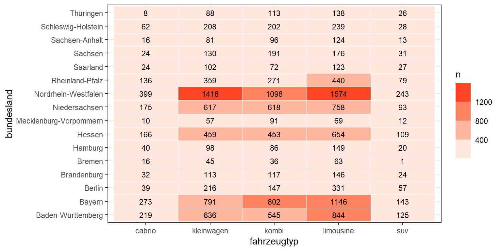
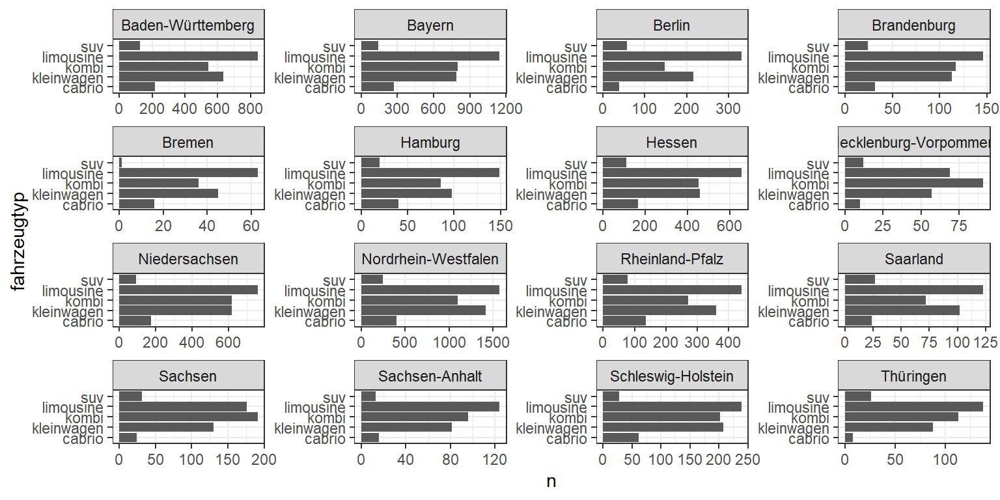

# Aggregierte Daten

Das Thema Visualisierung von **aggregierten Daten** erschließen wir uns erneut anhand von Daten zu Gebrauchtwagenangeboten über Ebay Kleinanzeigen. 


```r
library(tidyverse)      
theme_set(theme_bw())   
df <- read_csv("data/gebrauchtwagen.csv")
glimpse(df)
```

```
## Rows: 20,000
## Columns: 13
## $ name        <chr> "smart_forTwo_Softtouch__passion_Inspektion_fuer_687_Euro_~
## $ preis       <dbl> 5299, 1100, 8199, 8999, 3600, 2490, 15500, 2700, 6200, 279~
## $ alter       <dbl> 7, 16, 14, 8, 13, 11, 7, 12, 8, 8, 22, 8, 9, 15, 16, 18, 1~
## $ kilometer   <dbl> 30000, 125000, 150000, 150000, 150000, 150000, 150000, 900~
## $ hersteller  <chr> "smart", "renault", "audi", "mercedes_benz", "bmw", "peuge~
## $ modell      <chr> "fortwo", "clio", "a4", "c_klasse", "3er", "1_reihe", "5er~
## $ fahrzeugtyp <chr> "kleinwagen", "kleinwagen", "kombi", "limousine", "limousi~
## $ getriebe    <chr> "automatik", "manuell", "automatik", "automatik", "manuell~
## $ ps          <dbl> 71, 75, 131, 136, 116, 68, 177, 69, 125, 67, 115, 121, 129~
## $ kraftstoff  <chr> "benzin", "benzin", "benzin", "diesel", "benzin", "diesel"~
## $ schaden     <chr> "nein", "nein", "nein", "nein", "nein", "nein", "nein", "j~
## $ plz         <dbl> 35315, 36137, 85057, 10627, 65934, 14793, 28816, 30880, 71~
## $ bundesland  <chr> "Hessen", "Hessen", "Bayern", "Berlin", "Hessen", "Branden~
```

Bis hierhin haben wir hauptsächlich Rohdaten visualisiert. Nun wollen wir hingegen die Rohdaten auf eine höhere Ebene aggregieren und diese Ergebnisse visualisieren, z.B:

- Anzahl Autos je Fahrzeugtyp (SUV, Cabrio, Kleinwagen, etc)
- Durchschnittlicher Preis je Hersteller


```r
data <- df %>%
  group_by(fahrzeugtyp) %>%
  summarise(n = n(), preis = mean(preis))

data
```

```
## # A tibble: 5 x 3
##   fahrzeugtyp     n  preis
##   <chr>       <int>  <dbl>
## 1 cabrio       1639  8342.
## 2 kleinwagen   5418  3288.
## 3 kombi        4938  6130.
## 4 limousine    6974  5971.
## 5 suv          1031 11800.
```

Der wichtigste Grafiktyp für diese Art von Daten ist das Balkendiagramm (Bar chart), welches wir über das geometrische Object `geom_col` erezugen können.


```r
data %>% ggplot(aes(x = fahrzeugtyp, y = n)) + geom_col()
```


Eine praktische Alternative zu `geom_col` ist `geom_bar`, jedoch noch für den Fall, dass die Anzahl der Beobachtungen dargestellt werden soll. Die Funktion `geom_bar` kann direkt auf die Rohdaten angewendet werden. Hierbei wird das Zählen der Fälle implizit durch die Funktion ausgeführt und muss nicht explizit per Code berechnet werden. 


```r
df %>% ggplot(aes(x = fahrzeugtyp)) + geom_bar()
```



## Sortierung
Ein typisches Problem ist, dass eine Text-Variable (*character*) wie `fahrzeugtyp` zunächst einmal nur alfabetisch sortiert werden kann. Für eine bessere Interpretierbarkeit ist es jedoch meistens sinnvoll, die Balken sortiert nach ihrer Höhe anzuordnen. Dafür müssen wie die Text-Variable in eine sogenannte Faktor-Variable (*factor*) umwandenln. Faktoren lassen sich nach unterschiedlichsten Kriterien sortieren, bspw. über die Funktion `fct_reorder`. 


```r
data %>% ggplot(aes(x = fct_reorder(fahrzeugtyp, -preis), y = preis)) + geom_col()
```


## Überlappungen
Eine weitere typische Schwierigkeit besteht in sich überlappenden Labels. Dieses Problem tritt insbesondere auf der x-Achse auf. Deshalb lohnt es sich, die Achsenzuordnung zu ändern und so ein horizontales Balkendiagramm zu erzeugen.


```r
# Map to y axis
data <- df %>% 
  group_by(bundesland) %>%
  summarise(n = n(),
            preis = mean(preis))

data %>% ggplot(aes(x = bundesland, y = preis)) + geom_col()
```



```r
data %>% ggplot(aes(y = bundesland, x = preis)) + geom_col()
```



Eine weitere Möglichkeit besteht darin, mehrere kleinere Balken zu einem großen Balken für "Sonstige" zusammenzufassen. 

```r
df %>% ggplot(aes(y = fct_lump(bundesland, n= 5))) + geom_bar()
```



## Zwei kategoriale Variablen

Wenn wir die aggregierten Statistiken nicht für eine sondern zwei kategorielle Variablen berechnen (bspw. für `bundesland` und `fahrzeugtyp`), gibt es mehrere denkbare Darstellungsformen. 

Eine Heatmap via `geom_tile` eignet sich insbesondere, wenn die kategorialen Variablen viele Ausprägungen haben, so wie es hier der Fall ist. 


```r
df %>% count(bundesland, fahrzeugtyp) %>% ggplot() + 
  geom_tile(aes(x = fahrzeugtyp, y = bundesland, fill = n), color = "white") +
  geom_text(aes(x = fahrzeugtyp, y = bundesland, label = n), size = 3) +
  scale_fill_binned(low = "white", high = "red")
```



Facetten-Plots können grundsätzlich auch für solche Fälle helfen. Im hier vorliegenden Fall, mit vielen Ausprägungen wird ein Facettenplot aber schnell unübersichtlich.


```r
df %>% 
  count(bundesland, fahrzeugtyp) %>% 
  ggplot() + 
  geom_col(aes(y = fahrzeugtyp, x = n)) +
  facet_wrap(~bundesland, scales = "free")
```



