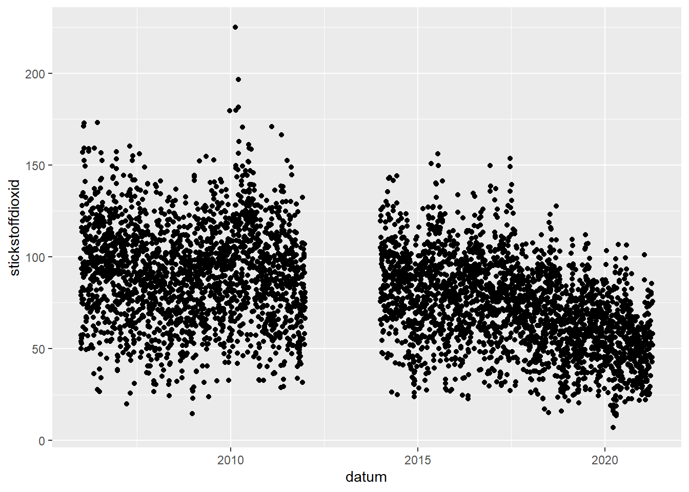
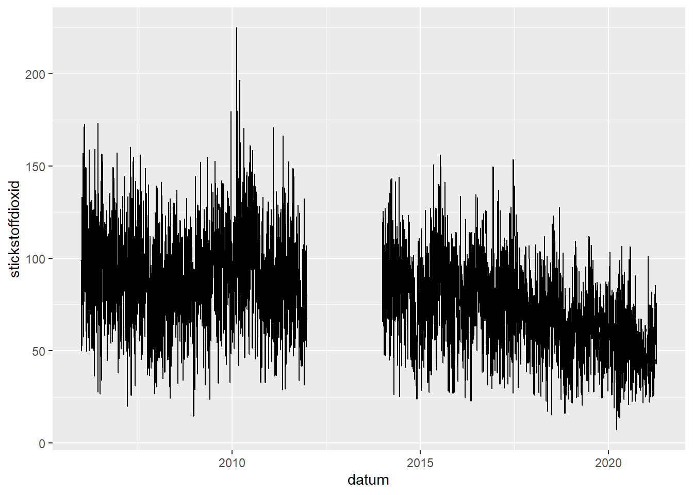
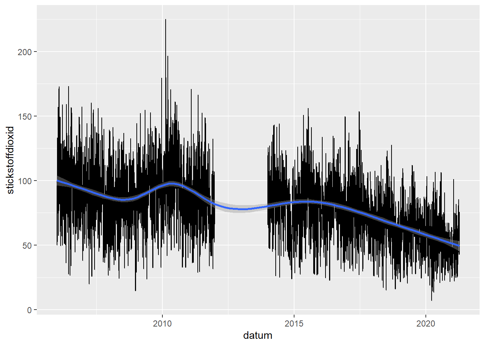
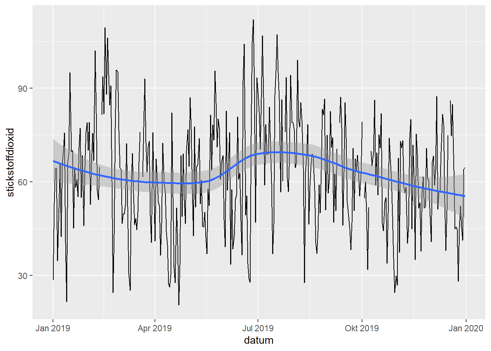
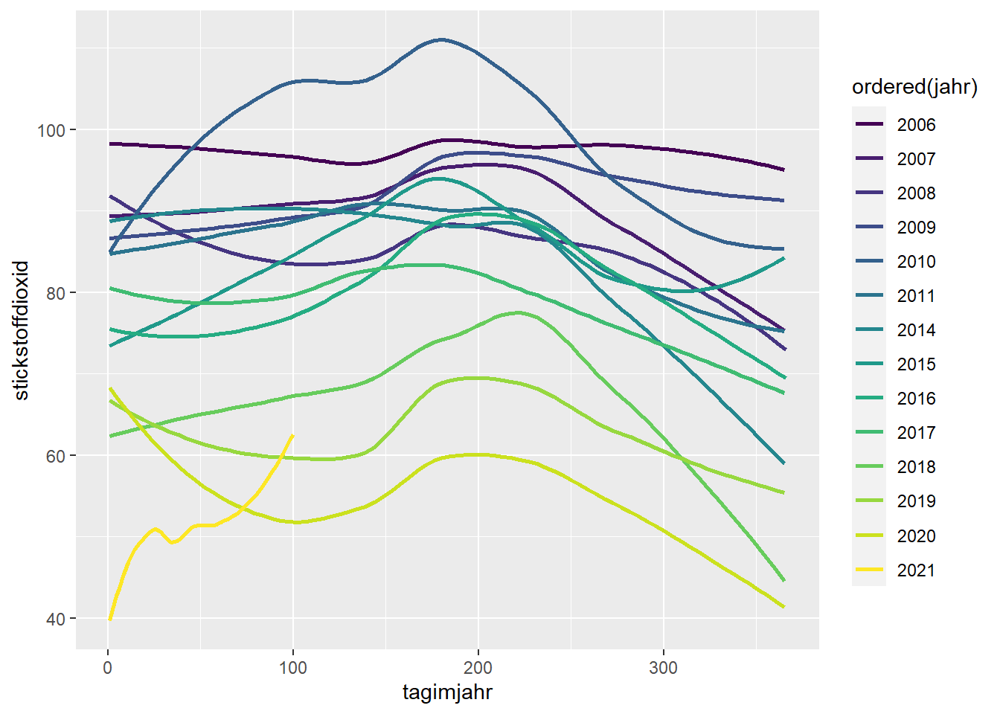
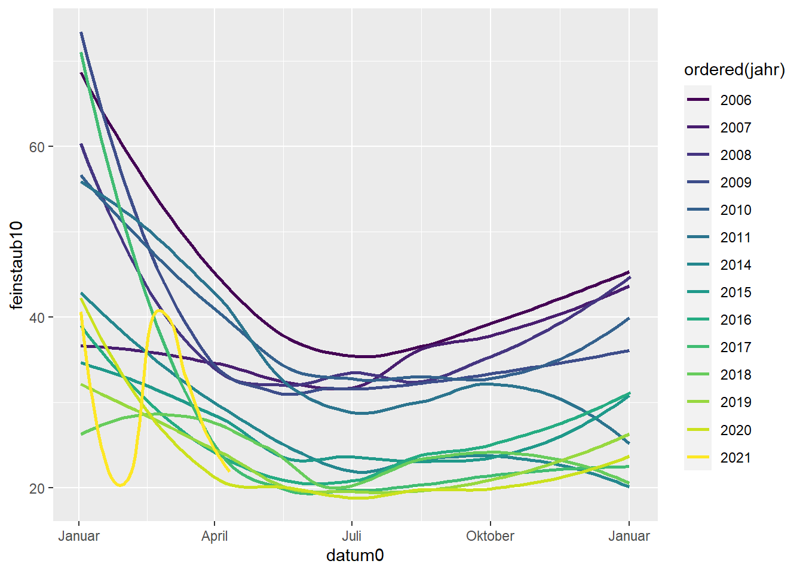

# Zeit

Visualisierung von Geodaten


```r
library(tidyverse)
library(sf)
load("data/airquality.Rdata")
```
Der Zeit-Aspekt bringt einige Besonderheiten mit sich. Unter anderem wollen wir prüfen, ob die Entwicklung von Luftqualitätsmessungen einem bestimmten Saisonalen (oder anderartigem) Muster unterliegt. Dafür extrahieren wir aus der Datumsvariable zunächst zusätzliche Informationen. 


```r
df <- airquality_timeseries
df <- df %>% mutate(jahr = lubridate::year(datum),
                    tagimjahr = lubridate::yday(datum),
                    monat = lubridate::month(datum, label=TRUE, abbr = TRUE),
                    wochentag = lubridate::wday(datum, label=TRUE, abbr = TRUE))
```

Das besondere an den Variablen `monat` und `wochentag` ist, dass es sich hierbei um ordinal-skalierte Variablen handelt (*ordered factors*). Dies hat den Vorteil, dass sie sprechend als Januar, Februar, etc. dargestellt werden, sie aber der natürlichen Sortierung unterliegen.


Zunächst fokussieren wir uns auf die Besonderheiten bzgl. der Visualisierung einer einzelnen Zeitreihe. Dazu beschränkten wir den Zeitreihen-Datensatz auf einen Standort. 


```r
muenchen <- df %>% dplyr::filter(standort == "München/Landshuter Allee")
```

Zunächst stellt sich die Frage nach einem geeigneten geometrischen Objekt (*geometric object*). Grundsätzlich eignen sich Liniendiagramme (`geom_line`) gut für Zeitreihen. Aufgrund der hier vorliegenden starken Schwankungen kann es aber Sinn machen, die einzelnen Messpunkte (`geom_point`) darzustellen. Um den langfristigen Trend zu verdeutlichen eignet sich eine geglättete Trendlinie (`geom_smooth`).

```r
p <- muenchen %>% ggplot(aes(datum, stickstoffdioxid)) 
p + geom_point()
```



```r
p + geom_line()
```



```r
p + geom_line() + geom_smooth()
```



Es lässt sich bereits erahnen, dass im vorliegenden Fall die Schwankungen einem bestimmten  Muster mit Zeitbezug folgen. Schauen wir uns ein einzelnes Jahr konkreter an. Bei `stickstoffdioxid` scheint im Jahr 2019 kein klares saisonales Muster vorzuliegen. 


```r
(p <- muenchen %>% 
  filter(jahr==2019) %>% 
  ggplot(aes(datum, stickstoffdioxid)) + 
  geom_line() + geom_smooth())
```



Wir können an diesem Beispiel aber demonstrieren, wie sich die Datum-Labels und die Gitterlinien anpassen lassen. Die unzähligen Formatierungsoptionen für Datums-Labels können via `help(strftime)` nachfollzogen werden.


```r
p + scale_x_date(date_labels = '%a, %d. %B %y', 
                 date_breaks = "4 months", 
                 date_minor_breaks = "1 months")
```


Um nachzuvollziehen, ob sich ein bestimmtes saisonales Muster nur in einem Jahr zeigt, oder in allen Jahren, können wir die Variable `jahr` der Ästhetik Farbe zuordnen. Das funktioniert allerdings nur, wenn sie die numerische Variable `jahr` in eine kategoriale Variable (*factor*) umwandeln. Speziell geeignet ist hier wieder die Ordinal-Skalierung (*ordered*).


```r
muenchen %>% 
  ggplot(aes(tagimjahr, stickstoffdioxid, color = ordered(jahr))) + 
  geom_smooth(se=FALSE)
```



Um den Tag im Jahr sprechender zu gestalten, bedienen wir uns eines Tricks:


```r
muenchen %>% 
  mutate(datum0 = as.Date("1970-01-01") + tagimjahr) %>%
  ggplot(aes(datum0, feinstaub10, color = ordered(jahr)))+ 
  geom_smooth(se=FALSE) +
  scale_x_date(date_labels = "%B")
```




